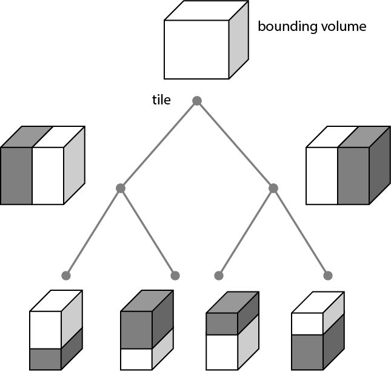
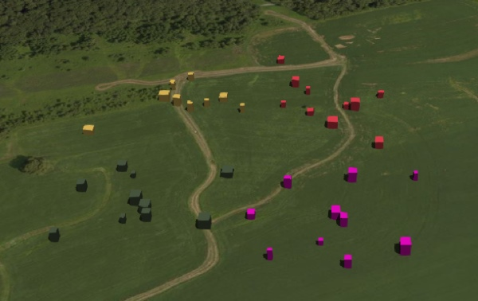
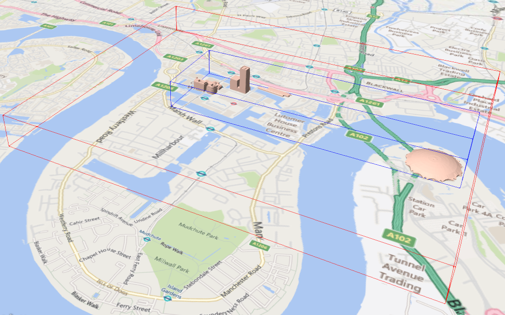
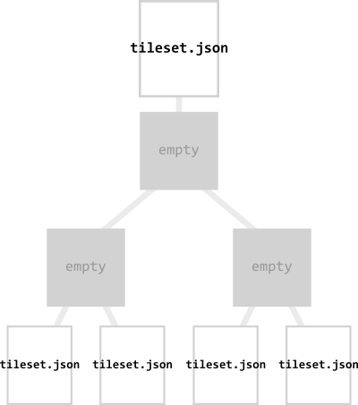
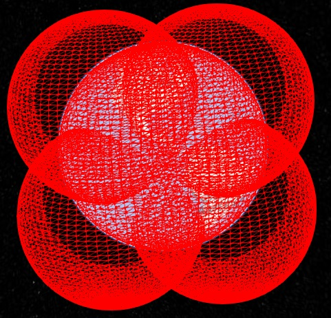
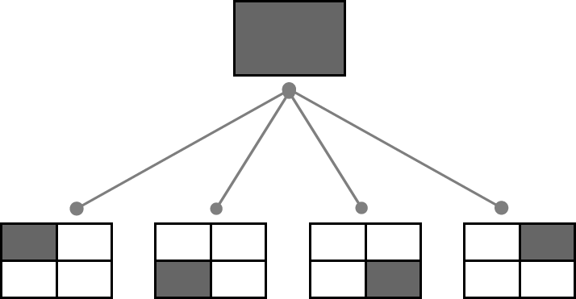
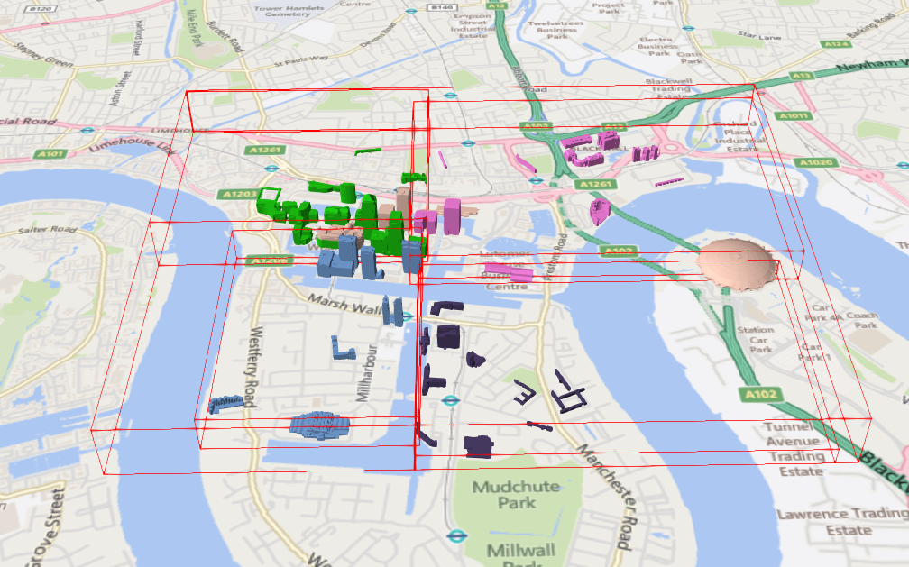
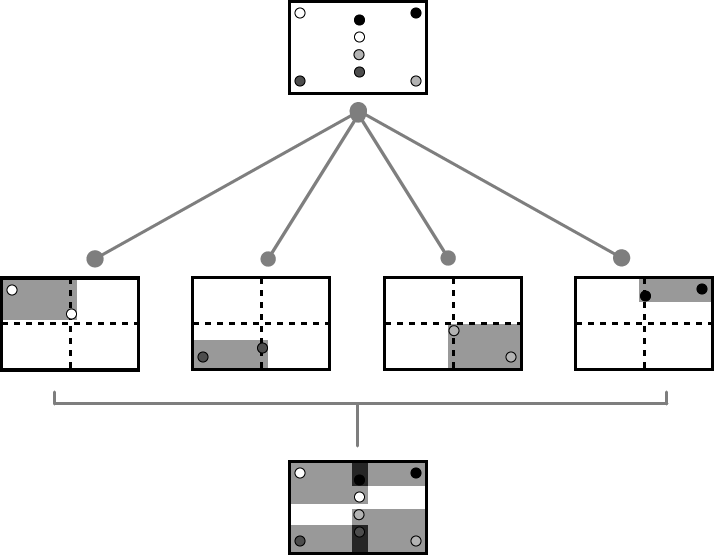
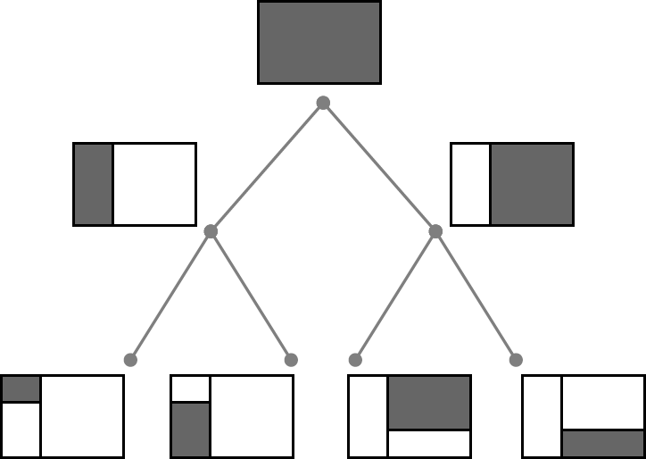
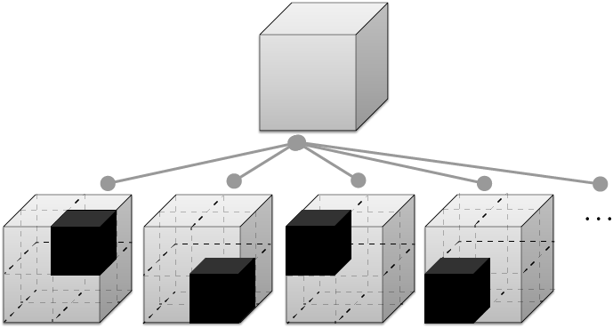

# 3D Tiles Format Specification

**Version 1.0**, June 6th, 2018

<p align="center"></p>

This document describes the specification for 3D Tiles, an open standard for streaming massive heterogeneous 3D geospatial datasets.


Editors:
  * Patrick Cozzi, [@pjcozzi](https://twitter.com/pjcozzi), [patrick@cesium.com](mailto:patrick@cesium.com)
  * Sean Lilley, [@lilleyse](https://twitter.com/lilleyse), [sean@cesium.com](mailto:sean@cesium.com)
  * Gabby Getz, [@gabbygetz](https://twitter.com/gabbygetz), [gabby@cesium.com](mailto:gabby@cesium.com)

Acknowledgements:
* Matt Amato, [@matt_amato](https://twitter.com/matt_amato)
* Erik Andersson, [@e-andersson](https://github.com/e-andersson)
* Dan Bagnell, [@bagnell](https://github.com/bagnell)
* Ray Bentley
* Jannes Bolling, [@jbo023](https://github.com/jbo023)
* Dylan Brown, [@Dylan-Brown](http://www.github.com/Dylan-Brown)
* Sarah Chow, [cesium.com/team/SarahChow](https://cesium.com/team/SarahChow/)
* Paul Connelly
* Volker Coors
* Tom Fili, [@CesiumFili](https://twitter.com/CesiumFili)
* Leesa Fini, [@LeesaFini](http://www.github.com/LeesaFini)
* Ralf Gutbell
* Frederic Houbie
* Christopher Mitchell, Ph.D., [@KermMartian](https://github.com/KermMartian)
* Claus Nagel
* Jean-Philippe Pons
* Carl Reed
* Kevin Ring, [www.kotachrome.com/kevin](http://www.kotachrome.com/kevin/)
* Scott Simmons
* Rob Taglang, [@lasalvavida](https://github.com/lasalvavida)
* Stan Tillman
* Piero Toffanin, [@pierotofy](https://github.com/pierotofy)
* Pano Voudouris
* Dave Wesloh

## Contents

* [Introduction](#introduction)
* [File extensions and media types](#file-extensions-and-media-types)
* [JSON encoding](#json-encoding)
* [URIs](#uris)
* [Units](#units)
* [Concepts](#concepts)
  * [Coordinate reference system (CRS)](#coordinate-reference-system-crs)
  * [Tiles](#tiles)
    * [Geometric error](#geometric-error)
    * [Refinement](#refinement)
        * [Replacement](#replacement)
        * [Additive](#additive)
    * [Bounding volumes](#bounding-volumes)
        * [Region](#region)
        * [Box](#box)
        * [Sphere](#sphere)
    * [Viewer request volume](#viewer-request-volume)
    * [Transforms](#transforms)
        * [Tile transforms](#tile-transforms)
        * [glTF transforms](#gltf-transforms)
    * [Tile JSON](#tile-json)
  * [Tileset JSON](#tileset-json)
    * [External tilesets](#external-tilesets)
    * [Bounding volume spatial coherence](#bounding-volume-spatial-coherence)
    * [Spatial data structures](#spatial-data-structures)
        * [Quadtrees](#quadtrees)
        * [K-d trees](#k-d-trees)
        * [Octrees](#octrees)
        * [Grids](#grids)
  * [Specifying extensions and application specific extras](#specifying-extensions-and-application-specific-extras)
* [Tile format specifications](#tile-format-specifications)
* [Declarative styling specification](#declarative-styling-specification)
* [Property reference](#property-reference)
* [License](#license)

## Introduction

3D Tiles is designed for streaming and rendering massive 3D geospatial content such as Photogrammetry, 3D Buildings, BIM/CAD, Instanced Features, and Point Clouds. It defines a hierarchical data structure and a set of tile formats which deliver renderable content. 3D Tiles does not define explicit rules for visualization of the content; a client may visualize 3D Tiles data however it sees fit.

In 3D Tiles, a _tileset_ is a set of _tiles_ organized in a spatial data structure, the _tree_. A tileset is described by at least one tileset JSON file containing tileset metadata and a tree of tile objects, each of which may reference renderable content of one of the following formats:

Format|Uses
---|---
[Batched 3D Model (`b3dm`)](./TileFormats/Batched3DModel/README.md)|Heterogeneous 3D models. E.g. textured terrain and surfaces, 3D building exteriors and interiors, massive models.
[Instanced 3D Model (`i3dm`)](./TileFormats/Instanced3DModel/README.md)|3D model instances. E.g. trees, windmills, bolts.
[Point Cloud (`pnts`)](./TileFormats/PointCloud/README.md)|Massive number of points.
[Composite (`cmpt`)](./TileFormats/Composite/README.md)|Concatenate tiles of different formats into one tile.

A tile's _content_, an individual instance of a tile format, is a binary blob with format-specific components including a [Feature Table](./TileFormats/FeatureTable/README.md) and a [Batch Table](./TileFormats/BatchTable/README.md).

The content references a set of _features_, such as 3D models representing buildings or trees, or points in a point cloud. Each feature has position and appearance properties stored in the tile's Feature Table, and additional application-specific properties stored in the Batch Table. A client may choose to select features at runtime and retrieve their properties for visualization or analysis.

The Batched 3D Model and Instanced 3D Model formats are built on [glTF](https://github.com/KhronosGroup/glTF), an open specification designed for the efficient transmission of 3D content. The tile content of these formats embed a glTF asset, which contains model geometry and texture information, in the binary body. The Point Cloud format does not embed glTF.

Tiles are organized in a tree which incorporates the concept of Hierarchical Level of Detail (HLOD) for optimal rendering of spatial data. Each tile has a _bounding volume_, an object defining a spatial extent completely enclosing its content. The tree has [spatial coherence](#bounding-volume-spatial-coherence); the content for child tiles are completely inside the parent's bounding volume.



A tileset may use a 2D spatial tiling scheme similar to raster and vector tiling schemes (like a Web Map Tile Service (WMTS) or XYZ scheme) that serve predefined tiles at several levels of detail (or zoom levels). However since the content of a tileset is often non-uniform or may not easily be organized in only two dimensions, the tree can be any [spatial data structure](#spatial-data-structures) with spatial coherence, including k-d trees, quadtrees, octrees, and grids.

Optionally a [3D Tiles Style](./Styling/), or _style_, may be applied to a tileset. A style defines expressions to be evaluated which modify how each feature is displayed.

## File extensions and media types

3D Tiles uses the following file extensions and media types.

* Tileset files use the `.json` extension and the `application/json` media type.
* Tile content files use the file type and media type specific to their [tile format specification](#tile-format-specifications).
* Tileset style files use the `.json` extension and the `application/json` media type.

Explicit file extensions are optional. Valid implementations may ignore it and identify a content's format by the `magic` field in its header.

## JSON encoding

3D Tiles has the following restrictions on JSON formatting and encoding.

  1. JSON must use UTF-8 encoding without BOM.
  2. All strings defined in this spec (properties names, enums) use only ASCII charset and must be written as plain text.
  3. Names (keys) within JSON objects must be unique, i.e., duplicate keys aren't allowed.

## URIs

3D Tiles uses URIs to reference tile content. These URIs may point to [relative external references (RFC3986)](https://tools.ietf.org/html/rfc3986#section-4.2) or be data URIs that embed resources in the JSON. Embedded resources use [the "data" URL scheme (RFC2397)](https://tools.ietf.org/html/rfc2397).

When the URI is relative, its base is always relative to the referring tileset JSON file.

Client implementations are required to support relative external references and embedded resources. Optionally, client implementations may support other schemes (such as `http://`). All URIs must be valid and resolvable.

## Units

The unit for all linear distances is meters.

All angles are in radians.

## Coordinate reference system (CRS)

3D Tiles uses a right-handed Cartesian coordinate system; that is, the cross product of _x_ and _y_ yields _z_. 3D Tiles defines the _z_ axis as up for local Cartesian coordinate systems. A tileset's global coordinate system will often be in a [WGS 84](http://earth-info.nga.mil/GandG/publications/tr8350.2/wgs84fin.pdf) earth-centered, earth-fixed (ECEF) reference frame ([EPSG 4978](http://spatialreference.org/ref/epsg/4978/)), but it doesn't have to be, e.g., a power plant may be defined fully in its local coordinate system for use with a modeling tool without a geospatial context.

An additional [tile transform](#tile-transforms) may be applied to transform a tile's local coordinate system to the parent tile's coordinate system.

The [region](#region) bounding volume specifies bounds using a geographic coordinate system (latitude, longitude, height), specifically [EPSG 4979](http://spatialreference.org/ref/epsg/4979/).

## Concepts

### Tiles

Tiles consist of metadata used to determine if a tile is rendered, a reference to the renderable content, and an array of any children tiles.

#### Geometric error

Tiles are structured into a tree incorporating _Hierarchical Level of Detail_ (HLOD) so that at runtime a client implementation will need to determine if a tile is sufficiently detailed for rendering and if the content of tiles should be successively refined by children tiles of higher resolution. An implementation will consider a maximum allowed _Screen-Space Error_ (SSE), the error measured in pixels.

A tile's geometric error defines the selection metric for that tile. Its value is a nonnegative number that specifies the error, in meters, of the tile's simplified representation of its source geometry. The root tile, being the most simplified version of the source geometry, will have the greatest geometric error. Then each successive level of children will have a lower geometric error than its parent, with leaf tiles having a geometric error of or close to 0.

In a client implementation, geometric error is used with other screen space metrics&mdash;e.g., distance from the tile to the camera, screen size, and resolution&mdash; to calculate the SSE introduced if this tile is rendered and its children are not. If the introduced SSE exceeds the maximum allowed, then the tile is refined and its children are considered for rendering.

The geometric error is formulated based on a metric like point density, tile size in meters, or another factor specific to that tileset. In general, a higher geometric error means a tile will be refined more aggressively, and children tiles will be loaded and rendered sooner.

#### Refinement

Refinement determines the process by which a lower resolution parent tile renders when its higher resolution children are selected to be rendered. Permitted refinement types are replacement (`"REPLACE"`) and additive (`"ADD"`). If the tile has replacement refinement, the children tiles are rendered in place of the parent, that is, the parent tile is no longer rendered. If the tile has additive refinement, the children are rendered in addition to the parent tile.

A tileset can use replacement refinement exclusively, additive refinement exclusively, or any combination of additive and replacement refinement.

A refinement type is required for the root tile of a tileset; it is optional for all other tiles. When omitted, a tile inherits the refinement type of its parent.

##### Replacement

If a tile uses replacement refinement, when refined it renders its children in place of itself.

| Parent Tile | Refined |
|:---:|:--:|
|  |  |

##### Additive

If a tile uses additive refinement, when refined it renders itself and its children simultaneously.

| Parent Tile | Refined |
|:---:|:--:|
|  |  |

#### Bounding volumes

A bounding volume defines the spatial extent enclosing a tile or a tile's content. To support tight fitting volumes for a variety of datasets such as regularly divided terrain, cities not aligned with a line of latitude or longitude, or arbitrary point clouds, the bounding volume types include an oriented bounding box, a bounding sphere, and a geographic region defined by minimum and maximum latitudes, longitudes, and heights.

| Bounding box | Bounding sphere | Bounding region |
|:---:|:---:|:---:|
|  |  |  |

##### Region

The `boundingVolume.region` property is an array of six numbers that define the bounding geographic region with latitude, longitude, and height coordinates with the order `[west, south, east, north, minimum height, maximum height]`. Latitudes and longitudes are in the WGS 84 datum as defined in [EPSG 4979](http://spatialreference.org/ref/epsg/4979/) and are in radians. Heights are in meters above (or below) the [WGS 84 ellipsoid](http://earth-info.nga.mil/GandG/publications/tr8350.2/wgs84fin.pdf).


```JSON
"boundingVolume": {
  "region": [
    -1.3197004795898053,
    0.6988582109,
    -1.3196595204101946,
    0.6988897891,
    0,
    20
  ]
}
```

##### Box

The `boundingVolume.box` property is an array of 12 numbers that define an oriented bounding box in a right-handed 3-axis (x, y, z) Cartesian coordinate system where the _z_-axis is up. The first three elements define the x, y, and z values for the center of the box. The next three elements (with indices 3, 4, and 5) define the _x_-axis direction and half-length.  The next three elements (indices 6, 7, and 8) define the _y_-axis direction and half-length.  The last three elements (indices 9, 10, and 11) define the _z_-axis direction and half-length.


```JSON
"boundingVolume": {
  "box": [
    0,   0,   10,
    100, 0,   0,
    0,   100, 0,
    0,   0,   10
  ]
}
```

##### Sphere

The `boundingVolume.sphere` property is an array of four numbers that define a bounding sphere.  The first three elements define the x, y, and z values for the center of the sphere in a right-handed 3-axis (x, y, z) Cartesian coordinate system where the _z_-axis is up.  The last element (with index 3) defines the radius in meters.


```JSON
"boundingVolume": {
  "sphere": [
    0,
    0,
    10,
    141.4214
  ]
}
```

#### Viewer request volume

A tile's `viewerRequestVolume` can be used for combining heterogeneous datasets, and can be combined with [external tilesets](#external-tilesets).

The following example has a building in a `b3dm` tile and a point cloud inside the building in a `pnts` tile.  The point cloud tile's `boundingVolume` is a sphere with a radius of `1.25`.  It also has a larger sphere with a radius of `15` for the `viewerRequestVolume`.  Since the `geometricError` is zero, the point cloud tile's content is always rendered (and initially requested) when the viewer is inside the large sphere defined by `viewerRequestVolume`.

```json
{
  "children": [{
    "transform": [
      4.843178171884396,   1.2424271388626869, 0,                  0,
      -0.7993325488216595,  3.1159251367235608, 3.8278032889280675, 0,
      0.9511533376784163, -3.7077466670407433, 3.2168186118075526, 0,
      1215001.7612985559, -4736269.697480114,  4081650.708604793,  1
    ],
    "boundingVolume": {
      "box": [
        0,     0,    6.701,
        3.738, 0,    0,
        0,     3.72, 0,
        0,     0,    13.402
      ]
    },
    "geometricError": 32,
    "content": {
      "uri": "building.b3dm"
    }
  }, {
    "transform": [
      0.968635634376879,    0.24848542777253732, 0,                  0,
      -0.15986650990768783,  0.6231850279035362,  0.7655606573007809, 0,
      0.19023066741520941, -0.7415493329385225,  0.6433637229384295, 0,
      1215002.0371330238,  -4736270.772726648,   4081651.6414821907, 1
    ],
    "viewerRequestVolume": {
      "sphere": [0, 0, 0, 15]
    },
    "boundingVolume": {
      "sphere": [0, 0, 0, 1.25]
    },
    "geometricError": 0,
    "content": {
      "uri": "points.pnts"
    }
  }]
}
```

For more on request volumes, see the [sample tileset](https://github.com/CesiumGS/3d-tiles-samples/tree/main/tilesets/TilesetWithRequestVolume) and [demo video](https://www.youtube.com/watch?v=PgX756Yzjf4).

#### Transforms

##### Tile transforms

To support local coordinate systems&mdash;e.g., so a building tileset inside a city tileset can be defined in its own coordinate system, and a point cloud tileset inside the building could, again, be defined in its own coordinate system&mdash;each tile has an optional `transform` property.

The `transform` property is a 4x4 affine transformation matrix, stored in column-major order, that transforms from the tile's local coordinate system to the parent tile's coordinate system&mdash;or the tileset's coordinate system in the case of the root tile.

The `transform` property applies to
* `tile.content`
   * Each feature's position.
   * Each feature's normal should be transformed by the top-left 3x3 matrix of the inverse-transpose of `transform` to account for [correct vector transforms when scale is used](http://www.realtimerendering.com/resources/RTNews/html/rtnews1a.html#art4).
   * `content.boundingVolume`, except when `content.boundingVolume.region` is defined, which is explicitly in EPSG:4979 coordinates.
* `tile.boundingVolume`, except when `tile.boundingVolume.region` is defined, which is explicitly in EPSG:4979 coordinates.
* `tile.viewerRequestVolume`, except when `tile.viewerRequestVolume.region` is defined, which is explicitly in EPSG:4979 coordinates.

The `transform` property scales the `geometricError` by the largest scaling factor from the matrix.

When `transform` is not defined, it defaults to the identity matrix:
```json
[
1.0, 0.0, 0.0, 0.0,
0.0, 1.0, 0.0, 0.0,
0.0, 0.0, 1.0, 0.0,
0.0, 0.0, 0.0, 1.0
]
```

The transformation from each tile's local coordinate system to the tileset's global coordinate system is computed by a top-down traversal of the tileset and by post-multiplying a child's `transform` with its parent's `transform` like a traditional scene graph or node hierarchy in computer graphics.

##### glTF transforms

[Batched 3D Model](TileFormats/Batched3DModel/README.md) and [Instanced 3D Model](TileFormats/Instanced3DModel/README.md) tiles embed glTF, which defines its own node hierarchy and uses a _y_-up coordinate system. Any transforms specific to a tile format and the `tile.transform` property are applied after these transforms are resolved.

###### glTF node hierarchy
First, glTF node hierarchy transforms are applied according to the [glTF specification](https://github.com/KhronosGroup/glTF/tree/master/specification/2.0#transformations).

###### _y_-up to _z_-up
Next, for consistency with the _z_-up coordinate system of 3D Tiles, glTFs must be transformed from _y_-up to _z_-up at runtime. This is done by rotating the model about the _x_-axis by &pi;/2 radians. Equivalently, apply the following matrix transform (shown here as row-major):
```json
[
1.0, 0.0,  0.0, 0.0,
0.0, 0.0, -1.0, 0.0,
0.0, 1.0,  0.0, 0.0,
0.0, 0.0,  0.0, 1.0
]
```

More broadly the order of transformations is:

1. [glTF node hierarchy transformations](#gltf-node-hierarchy)
2. [glTF _y_-up to _z_-up transform](#y-up-to-z-up)
3. Any tile format specific transforms.
   * [Batched 3D Model](TileFormats/Batched3DModel/README.md) Feature Table may define `RTC_CENTER` which is used to translate model vertices.
   * [Instanced 3D Model](TileFormats/Instanced3DModel/README.md) Feature Table defines per-instance position, normals, and scales. These are used to create per-instance 4x4 affine transform matrices that are applied to each instance.
4. [Tile transform](#tile-transforms)

> **Implementation note:** when working with source data that is inherently _z_-up, such as data in WGS 84 coordinates or in a local _z_-up coordinate system, a common workflow is:
> * Mesh data, including positions and normals, are not modified - they remain _z_-up.
> * The root node matrix specifies a column-major _z_-up to _y_-up transform. This transforms the source data into a _y_-up coordinate system as required by glTF.
> * At runtime the glTF is transformed back from _y_-up to _z_-up with the matrix above. Effectively the transforms cancel out.
>
> Example glTF root node:
>```json
>"nodes": [
>  {
>    "matrix": [1,0,0,0,0,0,-1,0,0,1,0,0,0,0,0,1],
>    "mesh": 0,
>    "name": "rootNode"
>  }
>]
>```

##### Example

For an example of the computed transforms (`transformToRoot` in the code above) for a tileset, consider:


The computed transform for each tile is:
* `TO`: `[T0]`
* `T1`: `[T0][T1]`
* `T2`: `[T0][T2]`
* `T3`: `[T0][T1][T3]`
* `T4`: `[T0][T1][T4]`

The positions and normals in a tile's content may also have tile-specific transformations applied to them _before_ the tile's `transform` (before indicates post-multiplying for affine transformations).  Some examples are:
* `b3dm` and `i3dm` tiles embed glTF, which defines its own node hierarchy and coordinate system. `tile.transform` is applied after these transforms are resolved. See [glTF transforms](#gltf-transforms).
* `i3dm`'s Feature Table defines per-instance position, normals, and scales.  These are used to create per-instance 4x4 affine transform matrices that are applied to each instance before `tile.transform`.
* Compressed attributes, such as `POSITION_QUANTIZED` in the Feature Tables for `i3dm` and `pnts`, and `NORMAL_OCT16P` in `pnts` should be decompressed before any other transforms.

Therefore, the full computed transforms for the above example are:
* `TO`: `[T0]`
* `T1`: `[T0][T1]`
* `T2`: `[T0][T2][pnts-specific transform, including RTC_CENTER (if defined)]`
* `T3`: `[T0][T1][T3][b3dm-specific transform, including RTC_CENTER (if defined), coordinate system transform, and glTF node hierarchy]`
* `T4`: `[T0][T1][T4][i3dm-specific transform, including per-instance transform, coordinate system transform, and glTF node hierarchy]`

##### Implementation example

_This section is non-normative_

The following JavaScript code shows how to compute this using Cesium's [Matrix4](https://github.com/CesiumGS/cesium/blob/main/Source/Core/Matrix4.js) and [Matrix3](https://github.com/CesiumGS/cesium/blob/main/Source/Core/Matrix3.js) types.

```javascript
function computeTransforms(tileset) {
    var t = tileset.root;
    var transformToRoot = defined(t.transform) ? Matrix4.fromArray(t.transform) : Matrix4.IDENTITY;

    computeTransform(t, transformToRoot);
}

function computeTransform(tile, transformToRoot) {
    // Apply 4x4 transformToRoot to this tile's positions and bounding volumes

    var inverseTransform = Matrix4.inverse(transformToRoot, new Matrix4());
    var normalTransform = Matrix4.getRotation(inverseTransform, new Matrix3());
    normalTransform = Matrix3.transpose(normalTransform, normalTransform);
    // Apply 3x3 normalTransform to this tile's normals

    var children = tile.children;
    var length = children.length;
    for (var i = 0; i < length; ++i) {
        var child = children[i];
        var childToRoot = defined(child.transform) ? Matrix4.fromArray(child.transform) : Matrix4.clone(Matrix4.IDENTITY);
        childToRoot = Matrix4.multiplyTransformation(transformToRoot, childToRoot, childToRoot);
        computeTransform(child, childToRoot);
    }
}
```

#### Tile JSON

A tile JSON object consists of the following properties.


The following example shows one non-leaf tile.

```json
{
  "boundingVolume": {
    "region": [
      -1.2419052957251926,
      0.7395016240301894,
      -1.2415404171917719,
      0.7396563300150859,
      0,
      20.4
    ]
  },
  "geometricError": 43.88464075650763,
  "refine" : "ADD",
  "content": {
    "boundingVolume": {
      "region": [
        -1.2418882438584018,
        0.7395016240301894,
        -1.2415422846940714,
        0.7396461198389616,
        0,
        19.4
      ]
    },
    "uri": "2/0/0.b3dm"
  },
  "children": [...]
}
```

The `boundingVolume` defines a volume enclosing the tile, and is used to determine which tiles to render at runtime. The above example uses a `region` volume, but other [bounding volumes](#bounding-volumes), such as `box` or `sphere`, may be used.

The `geometricError` property is a nonnegative number that defines the error, in meters, introduced if this tile is rendered and its children are not.  At runtime, the geometric error is used to compute _Screen-Space Error_ (SSE), the error measured in pixels.  The SSE determines if a tile is sufficiently detailed for the current view or if its children should be considered, see [Geometric error](#geometric-error).

The optional `viewerRequestVolume` property (not shown above) defines a volume, using the same schema as `boundingVolume`, that the viewer must be inside of before the tile's content will be requested and before the tile will be refined based on `geometricError`.  See the [Viewer request volume](#viewer-request-volume) section.

The `refine` property is a string that is either `"REPLACE"` for replacement refinement or `"ADD"` for additive refinement, see [Refinement](#refinement).  It is required for the root tile of a tileset; it is optional for all other tiles.  A tileset can use any combination of additive and replacement refinement.  When the `refine` property is omitted, it is inherited from the parent tile.

The `content` property is an object that contains metadata about the tile's renderable content.  `content.uri` is a uri that points to the tile's binary content (see [Tile format specifications](#tile-format-specifications)), or another tileset JSON to create a tileset of tileset (see [External tilesets](#external-tilesets)).

A file extension is not required for `content.uri`.  A content's [tile format](#tile-format-specifications) can be identified by the `magic` field in its header, or else as an external tileset if the content is JSON.

The `content.boundingVolume` property defines an optional [bounding volume](#bounding-volumes) similar to the top-level `boundingVolume` property. But unlike the top-level `boundingVolume` property, `content.boundingVolume` is a tightly fit bounding volume enclosing just the tile's content.  `boundingVolume` provides spatial coherence and `content.boundingVolume` enables tight view frustum culling, excluding from rendering any content not in the volume of what is potentially in view.  When it is not defined, the tile's bounding volume is still used for culling (see [Grids](#grids)).

The screenshot below shows the bounding volumes for the root tile for Canary Wharf.  `boundingVolume`, shown in red, encloses the entire area of the tileset; `content.boundingVolume` shown in blue, encloses just the four features (models) in the root tile.



The optional `transform` property (not shown above) defines a 4x4 affine transformation matrix that transforms the tile's `content`, `boundingVolume`, and `viewerRequestVolume` as described in the [Tile transform](#tile-transforms) section.

The `children` property is an array of objects that define child tiles. Each child tile's content is fully enclosed by its parent tile's `boundingVolume` and, generally, a `geometricError` less than its parent tile's `geometricError`.  For leaf tiles, the length of this array is zero, and `children` may not be defined. See the [Tileset JSON](#tileset-json) section below.

See [Property reference](#property-reference) for the tile JSON schema reference. The full JSON schema can be found in [`tile.schema.json`](./schema/tile.schema.json).

### Tileset JSON

3D Tiles uses one main tileset JSON file as the entry point to define a tileset. Both entry and external tileset JSON files are not required to follow a specific naming convention.

Here is a subset of the tileset JSON used for Canary Wharf (also see the complete file, [`tileset.json`](../examples/tileset.json)):
```json
{
  "asset" : {
    "version": "1.0",
    "tilesetVersion": "e575c6f1-a45b-420a-b172-6449fa6e0a59",
  },
  "properties": {
    "Height": {
      "minimum": 1,
      "maximum": 241.6
    }
  },
  "geometricError": 494.50961650991815,
  "root": {
    "boundingVolume": {
      "region": [
        -0.0005682966577418737,
        0.8987233516605286,
        0.00011646582098558159,
        0.8990603398325034,
        0,
        241.6
      ]
    },
    "geometricError": 268.37878244706053,
    "refine": "ADD",
    "content": {
      "uri": "0/0/0.b3dm",
      "boundingVolume": {
        "region": [
          -0.0004001690908972599,
          0.8988700116775743,
          0.00010096729722787196,
          0.8989625664878067,
          0,
          241.6
        ]
      }
    },
    "children": [..]
  }
}
```

The tileset JSON has four top-level properties: `asset`, `properties`, `geometricError`, and `root`.

`asset` is an object containing metadata about the entire tileset. The `asset.version` property is a string that defines the 3D Tiles version, which specifies the JSON schema for the tileset and the base set of tile formats.  The `tilesetVersion` property is an optional string that defines an application-specific version of a tileset, e.g., for when an existing tileset is updated.

> **Implementation Note**: `tilesetVersion` can be used as a query parameter when requesting content to avoid using outdated content from a cache.

`properties` is an object containing objects for each per-feature property in the tileset.  This tileset JSON snippet is for 3D buildings, so each tile has building models, and each building model has a `Height` property (see [Batch Table](TileFormats/BatchTable/README.md)).  The name of each object in `properties` matches the name of a per-feature property, and its value defines its `minimum` and `maximum` numeric values, which are useful, for example, for creating color ramps for styling.

`geometricError` is a nonnegative number that defines the error, in meters, that determines if the tileset is rendered.  At runtime, the geometric error is used to compute _Screen-Space Error_ (SSE), the error measured in pixels.  If the SSE does not exceed a required minimum, the tileset should not be rendered, and none of its tiles should be considered for rendering, see [Geometric error](#geometric-error).

`root` is an object that defines the root tile using the tile JSON described in the [above section](#tiles).  `root.geometricError` is not the same as the tileset's top-level `geometricError`. The tileset's `geometricError` is used at runtime to determine the SSE at which the tileset's root tile renders; `root.geometricError` is used at runtime to determine the SSE at which the root tile's children are rendered.

#### External tilesets

To create a tree of trees, a tile's `content.uri` can point to an external tileset (the uri of another tileset JSON file).  This enables, for example, storing each city in a tileset and then having a global tileset of tilesets.



When a tile points to an external tileset, the tile:

* Cannot have any children; `tile.children` must be `undefined` or an empty array.
* Cannot be used to create cycles, for example, by pointing to the same tileset file containing the tile or by pointing to another tileset file that then points back to the initial file containing the tile.
* Will be transformed by both the tile's `transform` and root tile's `transform`.  For example, in the following tileset referencing an external tileset, the computed transform for `T3` is `[T0][T1][T2][T3]`.


If an external tileset defines `asset.tilesetVersion`, this overrides the value from the parent tileset. If the external tileset does not define `asset.tilesetVersion`, the value is inherited from the parent tileset (if defined).

#### Bounding volume spatial coherence

As described above, the tree has spatial coherence; each tile has a bounding volume completely enclosing its content, and the content for child tiles are completely inside the parent's bounding volume.  This does not imply that a child's bounding volume is completely inside its parent's bounding volume.  For example:

<p align="center">
  <br />
  Bounding sphere for a terrain tile.
</p>

<p align="center">
  <br />
  Bounding spheres for the four child tiles.  The children's content is completely inside the parent's bounding volume, but the children's bounding volumes are not since they are not tightly fit.
</p>

#### Spatial data structures

3D Tiles incorporates the concept of Hierarchical Level of Detail (HLOD) for optimal rendering of spatial data. A tileset is composed of a tree, defined by `root` and, recursively, its `children` tiles, which can be organized by different types of spatial data structures.

A runtime engine is generic and will render any tree defined by a tileset. Any combination of tile formats and refinement approaches can be used, enabling flexibility in supporting heterogeneous datasets, see [Refinement](#refinement).

A tileset may use a 2D spatial tiling scheme similar to raster and vector tiling schemes (like a Web Map Tile Service (WMTS) or XYZ scheme) that serve predefined tiles at several levels of detail (or zoom levels). However since the content of a tileset is often non-uniform or may not easily be organized in only two dimensions, other spatial data structures may be more optimal.

Included below is a brief description of how 3D Tiles can represent various spatial data structures.

##### Quadtrees

A quadtree is created when each tile has four uniformly subdivided children (e.g., using the center latitude and longitude), similar to typical 2D geospatial tiling schemes.  Empty child tiles can be omitted.

<p align="center">
  <br />
  Classic quadtree subdivision.
</p>

3D Tiles enable quadtree variations such as non-uniform subdivision and tight bounding volumes (as opposed to bounding, for example, the full 25% of the parent tile, which is wasteful for sparse datasets).

<p align="center">
  <br />
  Quadtree with tight bounding volumes around each child.
</p>

For example, here is the root tile and its children for Canary Wharf.  Note the bottom left, where the bounding volume does not include the water on the left where no buildings will appear:



3D Tiles also enable other quadtree variations such as [loose quadtrees](http://www.tulrich.com/geekstuff/partitioning.html), where child tiles overlap but spatial coherence is still preserved, i.e., a parent tile completely encloses all of its children.  This approach can be useful to avoid splitting features, such as 3D models, across tiles.

<p align="center">
  <br />
  Quadtree with non-uniform and overlapping tiles.
</p>

Below, the green buildings are in the left child and the purple buildings are in the right child.  Note that the tiles overlap so the two green and one purple building in the center are not split.


##### K-d trees

A k-d tree is created when each tile has two children separated by a _splitting plane_ parallel to the _x_, _y_, or _z_ axis (or latitude, longitude, height).  The split axis is often round-robin rotated as levels increase down the tree, and the splitting plane may be selected using the median split, surface area heuristics, or other approaches.

<p align="center">
  <br />
  Example k-d tree.  Note the non-uniform subdivision.
</p>

Note that a k-d tree does not have uniform subdivision like typical 2D geospatial tiling schemes and, therefore, can create a more balanced tree for sparse and non-uniformly distributed datasets.

3D Tiles enables variations on k-d trees such as [multi-way k-d trees](http://www.crs4.it/vic/cgi-bin/bib-page.cgi?id=%27Goswami:2013:EMF%27) where, at each leaf of the tree, there are multiple splits along an axis.  Instead of having two children per tile, there are `n` children.

##### Octrees

An octree extends a quadtree by using three orthogonal splitting planes to subdivide a tile into eight children.  Like quadtrees, 3D Tiles allows variations to octrees such as non-uniform subdivision, tight bounding volumes, and overlapping children.

<p align="center">
  <br />
  Traditional octree subdivision.
</p>

<p align="center">
  <br />
  Non-uniform octree subdivision for a point cloud using additive refinement. Point Cloud of <a href="http://robotics.cs.columbia.edu/~atroccol/ijcv/chappes.html">the Church of St Marie at Chappes, France</a> by Prof. Peter Allen, Columbia University Robotics Lab. Scanning by Alejandro Troccoli and Matei Ciocarlie.
</p>

##### Grids

3D Tiles enables uniform, non-uniform, and overlapping grids by supporting an arbitrary number of child tiles.  For example, here is a top-down view of a non-uniform overlapping grid of Cambridge:


3D Tiles takes advantage of empty tiles: those tiles that have a bounding volume, but no content. Since a tile's `content` property does not need to be defined, empty non-leaf tiles can be used to accelerate non-uniform grids with hierarchical culling. This essentially creates a quadtree or octree without hierarchical levels of detail (HLOD).

### Specifying extensions and application specific extras

3D Tiles defines extensions to allow the base specification to have extensibility for new features, as well as extras to allow for application specific metadata.

#### Extensions

Extensions allow the base specification to be extended with new features. The optional `extensions` dictionary property may be added to any 3D Tiles JSON object, which contains the name of the extensions and the extension specific objects. The following example shows a tile object with a hypothetical vendor extension which specifies a separate collision volume.
```JSON
{
  "transform": [
     4.843178171884396,   1.2424271388626869, 0,                  0,
    -0.7993325488216595,  3.1159251367235608, 3.8278032889280675, 0,
     0.9511533376784163, -3.7077466670407433, 3.2168186118075526, 0,
     1215001.7612985559, -4736269.697480114,  4081650.708604793,  1
  ],
  "boundingVolume": {
    "box": [
      0,     0,    6.701,
      3.738, 0,    0,
      0,     3.72, 0,
      0,     0,    13.402
    ]
  },
  "geometricError": 32,
  "content": {
    "uri": "building.b3dm"
  },
  "extensions": {
    "VENDOR_collision_volume": {
      "box": [
        0,     0,    6.8,
        3.8,   0,    0,
        0,     3.8,  0,
        0,     0,    13.5
      ]
    }
  }
}
```

All extensions used in a tileset or any descendant external tilesets must be listed in the entry tileset JSON in the top-level `extensionsUsed` array property, e.g.,

```JSON
{
    "extensionsUsed": [
        "VENDOR_collision_volume"
    ]
}
```

All extensions required to load and render a tileset or any descendant external tilesets must also be listed in the entry tileset JSON in the top-level `extensionsRequired` array property, such that `extensionsRequired` is a subset of `extensionsUsed`. All values in `extensionsRequired` must also exist in `extensionsUsed`.

#### Extras

The `extras` property allows application specific metadata to be added to any 3D Tiles JSON object. The following example shows a tile object with an additional application specific name property.
```JSON
{
  "transform": [
     4.843178171884396,   1.2424271388626869, 0,                  0,
    -0.7993325488216595,  3.1159251367235608, 3.8278032889280675, 0,
     0.9511533376784163, -3.7077466670407433, 3.2168186118075526, 0,
     1215001.7612985559, -4736269.697480114,  4081650.708604793,  1
  ],
  "boundingVolume": {
    "box": [
      0,     0,    6.701,
      3.738, 0,    0,
      0,     3.72, 0,
      0,     0,    13.402
    ]
  },
  "geometricError": 32,
  "content": {
    "uri": "building.b3dm"
  },
  "extras": {
    "name": "Empire State Building"
  }
}
```

See [Property reference](#property-reference) for the tileset JSON schema reference. The full JSON schema can be found in [`tileset.schema.json`](./schema/tileset.schema.json).

## Tile format specifications

Each tile's `content.uri` property may be the uri of binary blob that contains information for rendering the tile's 3D content. The content is an instance of one of the formats listed in the table below.

Format|Uses
---|---
[Batched 3D Model (`b3dm`)](./TileFormats/Batched3DModel/README.md)|Heterogeneous 3D models. E.g. textured terrain and surfaces, 3D building exteriors and interiors, massive models.
[Instanced 3D Model (`i3dm`)](./TileFormats/Instanced3DModel/README.md)|3D model instances. E.g. trees, windmills, bolts.
[Point Cloud (`pnts`)](./TileFormats/PointCloud/README.md)|Massive number of points.
[Composite (`cmpt`)](./TileFormats/Composite/README.md)|Concatenate tiles of different formats into one tile.

A tileset can contain any combination of tile formats.  3D Tiles may also support different formats in the same tile using a [Composite](./TileFormats/Composite/README.md) tile.

## Declarative styling specification

3D Tiles includes concise declarative styling defined with JSON and expressions written in a small subset of JavaScript augmented for styling.

Styles define how a featured is displayed, for example `show` and `color` (RGB and translucency), using an expression based on a feature's properties.

The following example colors features with a height above 90 as red and the others as white.
```json
{
    "color" : "(${Height} > 90) ? color('red') : color('white')"
}
```

For complete details, see the [Declarative Styling](./Styling/) specification.

## Property reference

* [`Tileset`](#reference-tileset)
  * [`Asset`](#reference-asset)
  * [`Bounding Volume`](#reference-bounding-volume)
  * [`Extension`](#reference-extension)
  * [`Extras`](#reference-extras)
  * [`Properties`](#reference-properties)
  * [`Tile`](#reference-tile)
    * [`Content`](#reference-tile-content)


---------------------------------------
<a name="reference-tileset"></a>
### Tileset

A 3D Tiles tileset.

**Properties**

|   |Type|Description|Required|
|---|----|-----------|--------|
|**asset**|`object`|Metadata about the entire tileset.| :white_check_mark: Yes|
|**properties**|`any`|A dictionary object of metadata about per-feature properties.|No|
|**geometricError**|`number`|The error, in meters, introduced if this tileset is not rendered. At runtime, the geometric error is used to compute screen space error (SSE), i.e., the error measured in pixels.| :white_check_mark: Yes|
|**root**|`object`|A tile in a 3D Tiles tileset.| :white_check_mark: Yes|
|**extensionsUsed**|`string` `[1-*]`|Names of 3D Tiles extensions used somewhere in this tileset.|No|
|**extensionsRequired**|`string` `[1-*]`|Names of 3D Tiles extensions required to properly load this tileset.|No|
|**extensions**|`object`|Dictionary object with extension-specific objects.|No|
|**extras**|`any`|Application-specific data.|No|

#### Tileset.asset  :white_check_mark:

Metadata about the entire tileset.

* **Type**: `object`
* **Required**: Yes

#### Tileset.properties

A dictionary object of metadata about per-feature properties.

* **Type**: `any`
* **Required**: No
* **Type of each property**: `object`

#### Tileset.geometricError :white_check_mark:

The error, in meters, introduced if this tileset is not rendered. At runtime, the geometric error is used to compute screen space error (SSE), i.e., the error measured in pixels.

* **Type**: `number`
* **Required**: Yes
* **Minimum**: ` >= 0`

#### Tileset.root :white_check_mark:

A tile in a 3D Tiles tileset.

* **Type**: `object`
* **Required**: Yes

#### Tileset.extensionsUsed

Names of 3D Tiles extensions used somewhere in this tileset.

* **Type**: `string` `[1-*]`
   * Each element in the array must be unique.
* **Required**: No

#### Tileset.extensionsRequired

Names of 3D Tiles extensions required to properly load this tileset.

* **Type**: `string` `[1-*]`
   * Each element in the array must be unique.
* **Required**: No

#### Tileset.extensions

Dictionary object with extension-specific objects.

* **Type**: `object`
* **Required**: No
* **Type of each property**: Extension

#### Tileset.extras

Application-specific data.

* **Type**: `any`
* **Required**: No


---------------------------------------
<a name="reference-asset"></a>
### Asset

Metadata about the entire tileset.

**Properties**

|   |Type|Description|Required|
|---|----|-----------|--------|
|**version**|`string`|The 3D Tiles version. The version defines the JSON schema for the tileset JSON and the base set of tile formats.| :white_check_mark: Yes|
|**tilesetVersion**|`string`|Application-specific version of this tileset, e.g., for when an existing tileset is updated.|No|
|**extensions**|`object`|Dictionary object with extension-specific objects.|No|
|**extras**|`any`|Application-specific data.|No|

#### Asset.version :white_check_mark:

The 3D Tiles version. The version defines the JSON schema for the tileset JSON and the base set of tile formats.

* **Type**: `string`
* **Required**: Yes

#### Asset.tilesetVersion

Application-specific version of this tileset, e.g., for when an existing tileset is updated.

* **Type**: `string`
* **Required**: No

#### Asset.extensions

Dictionary object with extension-specific objects.

* **Type**: `object`
* **Required**: No
* **Type of each property**: Extension

#### Asset.extras

Application-specific data.

* **Type**: `any`
* **Required**: No


---------------------------------------
<a name="reference-bounding-volume"></a>
### Bounding Volume

A bounding volume that encloses a tile or its content. At least one bounding volume property must be specified. This may be a `box`, `region`, or `sphere` property. Extensions may define additional bounding volume types. If more than one bounding volume is specified, clients may select the most appropriate option based on use case and performance requirements.

**Properties**

|   |Type|Description|Required|
|---|----|-----------|--------|
|**box**|`number` `[12]`|An array of 12 numbers that define an oriented bounding box. The first three elements define the x, y, and z values for the center of the box. The next three elements (with indices 3, 4, and 5) define the x axis direction and half-length. The next three elements (indices 6, 7, and 8) define the y axis direction and half-length. The last three elements (indices 9, 10, and 11) define the z axis direction and half-length.|No|
|**region**|`number` `[6]`|An array of six numbers that define a bounding geographic region in EPSG:4979 coordinates with the order [west, south, east, north, minimum height, maximum height]. Longitudes and latitudes are in radians, and heights are in meters above (or below) the WGS84 ellipsoid.|No|
|**sphere**|`number` `[4]`|An array of four numbers that define a bounding sphere. The first three elements define the x, y, and z values for the center of the sphere. The last element (with index 3) defines the radius in meters.|No|
|**extensions**|`object`|Dictionary object with extension-specific objects.|No|
|**extras**|`any`|Application-specific data.|No|

#### BoundingVolume.box

An array of 12 numbers that define an oriented bounding box. The first three elements define the x, y, and z values for the center of the box. The next three elements (with indices 3, 4, and 5) define the x axis direction and half-length. The next three elements (indices 6, 7, and 8) define the y axis direction and half-length. The last three elements (indices 9, 10, and 11) define the z axis direction and half-length.

* **Type**: `number` `[12]`
* **Required**: No

#### BoundingVolume.region

An array of six numbers that define a bounding geographic region in EPSG:4979 coordinates with the order [west, south, east, north, minimum height, maximum height]. Longitudes and latitudes are in radians, and heights are in meters above (or below) the WGS84 ellipsoid.

* **Type**: `number` `[6]`
* **Required**: No

#### BoundingVolume.sphere

An array of four numbers that define a bounding sphere. The first three elements define the x, y, and z values for the center of the sphere. The last element (with index 3) defines the radius in meters.

* **Type**: `number` `[4]`
* **Required**: No

#### BoundingVolume.extensions

Dictionary object with extension-specific objects.

* **Type**: `object`
* **Required**: No
* **Type of each property**: Extension

#### BoundingVolume.extras

Application-specific data.

* **Type**: `any`
* **Required**: No


---------------------------------------
<a name="reference-extension"></a>
### Extension

Dictionary object with extension-specific objects.

Additional properties are allowed.

* **Type of each property**: `object`


---------------------------------------
<a name="reference-extras"></a>
### Extras

Application-specific data.

* **JSON schema**: [`extras.schema.json`](schema/extras.schema.json)


---------------------------------------
<a name="reference-properties"></a>
### Properties

A dictionary object of metadata about per-feature properties.

**Properties**

|   |Type|Description|Required|
|---|----|-----------|--------|
|**maximum**|`number`|The maximum value of this property of all the features in the tileset.| :white_check_mark: Yes|
|**minimum**|`number`|The minimum value of this property of all the features in the tileset.| :white_check_mark: Yes|
|**extensions**|`object`|Dictionary object with extension-specific objects.|No|
|**extras**|`any`|Application-specific data.|No|

#### Properties.maximum :white_check_mark:

The maximum value of this property of all the features in the tileset.

* **Type**: `number`
* **Required**: Yes

#### Properties.minimum :white_check_mark:

The minimum value of this property of all the features in the tileset.

* **Type**: `number`
* **Required**: Yes

#### Properties.extensions

Dictionary object with extension-specific objects.

* **Type**: `object`
* **Required**: No
* **Type of each property**: Extension

#### Properties.extras

Application-specific data.

* **Type**: `any`
* **Required**: No


---------------------------------------
<a name="reference-tile"></a>
### Tile

A tile in a 3D Tiles tileset.

**Properties**

|   |Type|Description|Required|
|---|----|-----------|--------|
|**boundingVolume**|`object`|A bounding volume that encloses a tile or its content. At least one bounding volume property is required. Bounding volumes include `box`, `region`, or `sphere`.|:white_check_mark: Yes|
|**viewerRequestVolume**|`object`|A bounding volume that encloses a tile or its content. At least one bounding volume property is required. Bounding volumes include `box`, `region`, or `sphere`.|No|
|**geometricError**|`number`|The error, in meters, introduced if this tile is rendered and its children are not. At runtime, the geometric error is used to compute screen space error (SSE), i.e., the error measured in pixels.| :white_check_mark: Yes|
|**refine**|`string`|Specifies if additive or replacement refinement is used when traversing the tileset for rendering. This property is required for the root tile of a tileset; it is optional for all other tiles. The default is to inherit from the parent tile.|No|
|**transform**|`number` `[16]`|A floating-point 4x4 affine transformation matrix, stored in column-major order, that transforms the tile's content--i.e., its features as well as content.boundingVolume, boundingVolume, and viewerRequestVolume--from the tile's local coordinate system to the parent tile's coordinate system, or, in the case of a root tile, from the tile's local coordinate system to the tileset's coordinate system. transform does not apply to any volume property when the volume is a region, defined in EPSG:4979 coordinates. transform scales the `geometricError` by the maximum scaling factor from the matrix.|No, default: `[1,0,0,0,0,1,0,0,0,0,1,0,0,0,0,1]`|
|**content**|`object`|Metadata about the tile's content and a link to the content.|No|
|**children**|`array[]`|An array of objects that define child tiles. Each child tile content is fully enclosed by its parent tile's bounding volume and, generally, has a geometricError less than its parent tile's geometricError. For leaf tiles, the length of this array is zero, and children may not be defined.|No|
|**extensions**|`object`|Dictionary object with extension-specific objects.|No|
|**extras**|`any`|Application-specific data.|No|

#### Tile.boundingVolume :white_check_mark:

A bounding volume that encloses a tile or its content. At least one bounding volume property is required. Bounding volumes include `box`, `region`, or `sphere`.

* **Type**: `object`
* **Required**: Yes

#### Tile.viewerRequestVolume

A bounding volume that encloses a tile or its content. At least one bounding volume property is required. Bounding volumes include `box`, `region`, or `sphere`.

* **Type**: `object`
* **Required**: No

#### Tile.geometricError :white_check_mark:

The error, in meters, introduced if this tile is rendered and its children are not. At runtime, the geometric error is used to compute screen space error (SSE), i.e., the error measured in pixels.

* **Type**: `number`
* **Required**: Yes
* **Minimum**: ` >= 0`

#### Tile.refine

Specifies if additive or replacement refinement is used when traversing the tileset for rendering. This property is required for the root tile of a tileset; it is optional for all other tiles. The default is to inherit from the parent tile.

* **Type**: `string`
* **Required**: No
* **Allowed values**:
   * `"ADD"`
   * `"REPLACE"`

#### Tile.transform

A floating-point 4x4 affine transformation matrix, stored in column-major order, that transforms the tile's content--i.e., its features as well as content.boundingVolume, boundingVolume, and viewerRequestVolume--from the tile's local coordinate system to the parent tile's coordinate system, or, in the case of a root tile, from the tile's local coordinate system to the tileset's coordinate system. transform does not apply to any volume property when the volume is a region, defined in EPSG:4979 coordinates. transform scales the `geometricError` by the maximum scaling factor from the matrix.

* **Type**: `number` `[16]`
* **Required**: No, default: `[1,0,0,0,0,1,0,0,0,0,1,0,0,0,0,1]`

#### Tile.content

Metadata about the tile's content and a link to the content. When this is omitted the tile is just used for culling.

* **Type**: `object`
* **Required**: No

#### Tile.children

An array of objects that define child tiles. Each child tile content is fully enclosed by its parent tile's bounding volume and, generally, has a geometricError less than its parent tile's geometricError. For leaf tiles, the length of this array is zero, and children may not be defined.

* **Type**: `array[]`
   * Each element in the array must be unique.
* **Required**: No

#### Tile.extensions

Dictionary object with extension-specific objects.

* **Type**: `object`
* **Required**: No
* **Type of each property**: Extension

#### Tile.extras

Application-specific data.

* **Type**: `any`
* **Required**: No


---------------------------------------
<a name="reference-tile-content"></a>
### Content

Metadata about the tile's content and a link to the content.

**Properties**

|   |Type|Description|Required|
|---|----|-----------|--------|
|**boundingVolume**|`object`|A bounding volume that encloses a tile or its content. At least one bounding volume property is required. Bounding volumes include `box`, `region`, or `sphere`.|No|
|**uri**|`string`|A uri that points to the tile's content. When the uri is relative, it is relative to the referring tileset JSON file.| :white_check_mark: Yes|
|**extensions**|`object`|Dictionary object with extension-specific objects.|No|
|**extras**|`any`|Application-specific data.|No|

#### Content.boundingVolume

A bounding volume that encloses a tile or its content. At least one bounding volume property is required. Bounding volumes include `box`, `region`, or `sphere`.

* **Type**: `object`
* **Required**: No

#### Content.uri :white_check_mark:

A uri that points to the tile's content. When the uri is relative, it is relative to the referring tileset JSON file.

* **Type**: `string`
* **Required**: Yes

#### Content.extensions

Dictionary object with extension-specific objects.

* **Type**: `object`
* **Required**: No
* **Type of each property**: Extension

#### Content.extras

Application-specific data.

* **Type**: `any`
* **Required**: No


## License

Copyright 2016 - 2020 Cesium GS, Inc.

This Specification is licensed under a [Creative Commons Attribution 4.0 International License (CC BY 4.0)](http://creativecommons.org/licenses/by/4.0/).

The companies listed above have granted the Open Geospatial Consortium (OGC) a nonexclusive, royalty-free, paid up, worldwide license to copy and distribute this document and to modify this document and distribute copies of the modified version under a Attribution 4.0 International (CC BY 4.0) license.

Some parts of this Specification are purely informative and do not define requirements necessary for compliance and so are outside the Scope of this Specification. These parts of the Specification are marked as being non-normative, or identified as **Implementation Notes**.
