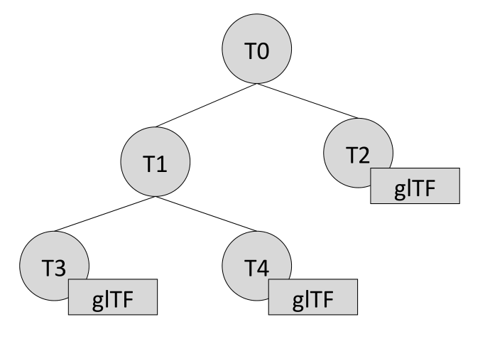
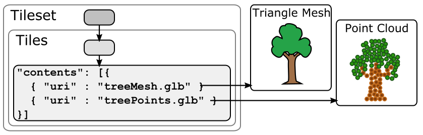
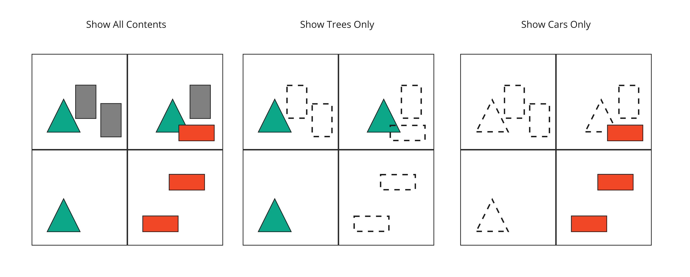
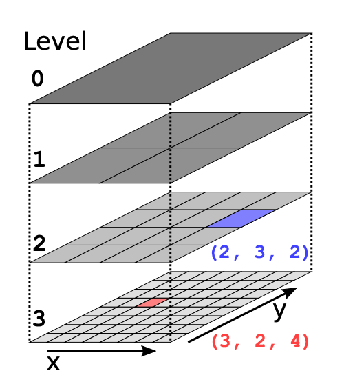
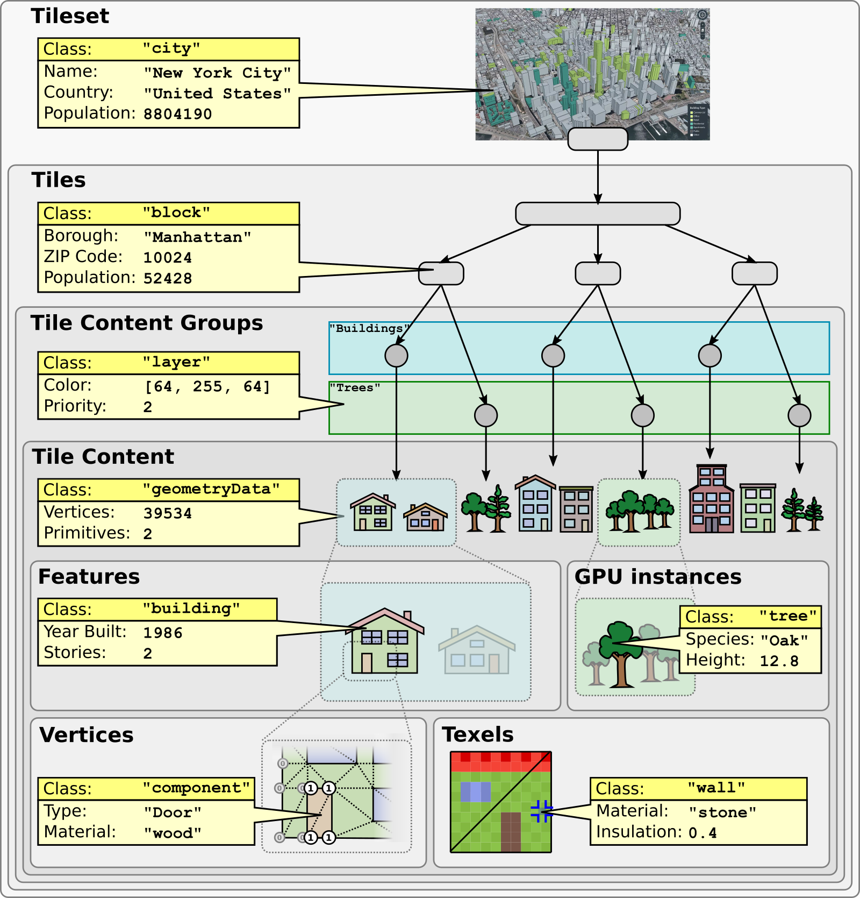
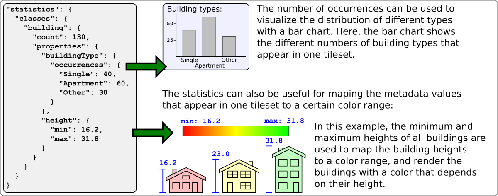

<!-- omit in toc -->
# 3D Tiles Format Specification

**Version 1.1**

<p align="center"></p>

This document describes the specification for 3D Tiles, an open standard for streaming massive heterogeneous 3D geospatial datasets.


Editors:
  * Patrick Cozzi, [@pjcozzi](https://twitter.com/pjcozzi), [patrick@cesium.com](mailto:patrick@cesium.com)
  * Sean Lilley, [@lilleyse](https://twitter.com/lilleyse), [sean@cesium.com](mailto:sean@cesium.com)
  * Gabby Getz, [@gabbygetz](https://twitter.com/gabbygetz), [gabby@cesium.com](mailto:gabby@cesium.com)

Acknowledgements:
* Matt Amato, [@matt_amato](https://twitter.com/matt_amato)
* Erik Andersson, [@e-andersson](https://github.com/e-andersson)
* Dan Bagnell, [@bagnell](https://github.com/bagnell)
* Ray Bentley
* Jannes Bolling, [@jbo023](https://github.com/jbo023)
* Dylan Brown, [@Dylan-Brown](http://www.github.com/Dylan-Brown)
* Sarah Chow, [cesium.com/team/SarahChow](https://cesium.com/team/SarahChow/)
* Paul Connelly
* Volker Coors
* Tom Fili, [@CesiumFili](https://twitter.com/CesiumFili)
* Leesa Fini, [@LeesaFini](http://www.github.com/LeesaFini)
* Ralf Gutbell
* Frederic Houbie
* Christopher Mitchell, Ph.D., [@KermMartian](https://github.com/KermMartian)
* Claus Nagel
* Jean-Philippe Pons
* Carl Reed
* Kevin Ring, [www.kotachrome.com/kevin](http://www.kotachrome.com/kevin/)
* Scott Simmons
* Rob Taglang, [@lasalvavida](https://github.com/lasalvavida)
* Stan Tillman
* Piero Toffanin, [@pierotofy](https://github.com/pierotofy)
* Pano Voudouris
* Dave Wesloh

<!-- omit in toc -->
## Contents

- [Introduction](#introduction)
- [File Extensions and Media Types](#file-extensions-and-media-types)
- [JSON encoding](#json-encoding)
- [URIs](#uris)
- [Units](#units)
- [Coordinate reference system (CRS)](#coordinate-reference-system-crs)
- [Concepts](#concepts)
  - [Tiles](#tiles)
    - [Tile Content](#tile-content)
    - [Geometric error](#geometric-error)
    - [Refinement](#refinement)
      - [Replacement](#replacement)
      - [Additive](#additive)
    - [Bounding volumes](#bounding-volumes)
      - [Region](#region)
      - [Box](#box)
      - [Sphere](#sphere)
      - [Content Bounding Volume](#content-bounding-volume)
    - [Viewer request volume](#viewer-request-volume)
    - [Transforms](#transforms)
      - [Tile transforms](#tile-transforms)
      - [glTF transforms](#gltf-transforms)
    - [Tile JSON](#tile-json)
  - [Tileset JSON](#tileset-json)
    - [External tilesets](#external-tilesets)
    - [Bounding volume spatial coherence](#bounding-volume-spatial-coherence)
    - [Spatial data structures](#spatial-data-structures)
      - [Quadtrees](#quadtrees)
      - [K-d trees](#k-d-trees)
      - [Octrees](#octrees)
      - [Grids](#grids)
    - [Implicit Tiling](#implicit-tiling)
  - [Metadata](#metadata)
    - [Metadata Schema](#metadata-schema)
    - [Assigning Metadata](#assigning-metadata)
    - [Metadata Statistics](#metadata-statistics)
  - [Specifying extensions and application specific extras](#specifying-extensions-and-application-specific-extras)
- [Tile format specifications](#tile-format-specifications)
- [Declarative styling specification](#declarative-styling-specification)
- [License](#license)

## Introduction

3D Tiles is designed for streaming and rendering massive 3D geospatial content such as Photogrammetry, 3D Buildings, BIM/CAD, Instanced Features, and Point Clouds. It defines a hierarchical data structure and a set of tile formats which deliver renderable content. 3D Tiles does not define explicit rules for visualization of the content; a client may visualize 3D Tiles data however it sees fit.

In 3D Tiles, a _tileset_ is a set of _tiles_ organized in a spatial data structure, the _tree_. A tileset is described by at least one tileset JSON file containing tileset metadata and a tree of tile objects, each of which may reference renderable content.

[glTF 2.0](https://github.com/KhronosGroup/glTF) is the primary tile format for 3D Tiles. glTF is an open specification designed for the efficient transmission and loading of 3D content. A glTF asset includes geometry and texture information for a single tile, and may be extended to include metadata, model instancing, and compression. glTF may be used for a wide variety of 3D content including:

* Heterogeneous 3D models. E.g. textured terrain and surfaces, 3D building exteriors and interiors, massive models
* 3D model instances. E.g. trees, windmills, bolts
* Massive point clouds

See [glTF Tile Format](./TileFormats/glTF/) for more details.

Tiles may also reference the legacy 3D Tiles 1.0 formats listed below. These formats were deprecated in 3D Tiles 1.1 and may be removed in a future version of 3D Tiles.

Legacy Format|Uses
---|---
[Batched 3D Model (`b3dm`)](./TileFormats/Batched3DModel/)|Heterogeneous 3D models
[Instanced 3D Model (`i3dm`)](./TileFormats/Instanced3DModel/)|3D model instances
[Point Cloud (`pnts`)](./TileFormats/PointCloud/)|Massive number of points
[Composite (`cmpt`)](./TileFormats/Composite/)|Concatenate tiles of different formats into one tile

A tile's _content_ is an individual instance of a tile format. A tile may have multiple contents.

The content references a set of _features_, such as 3D models representing buildings or trees, or points in a point cloud. Each feature has position and appearance properties and additional application-specific properties. A client may choose to select features at runtime and retrieve their properties for visualization or analysis.

Tiles are organized in a tree which incorporates the concept of Hierarchical Level of Detail (HLOD) for optimal rendering of spatial data. Each tile has a _bounding volume_, an object defining a spatial extent completely enclosing its content. The tree has [spatial coherence](#bounding-volume-spatial-coherence); the content for child tiles are completely inside the parent's bounding volume.


A tileset may use a 2D spatial tiling scheme similar to raster and vector tiling schemes (like a Web Map Tile Service (WMTS) or XYZ scheme) that serve predefined tiles at several levels of detail (or zoom levels). However since the content of a tileset is often non-uniform or may not easily be organized in only two dimensions, the tree can be any [spatial data structure](#spatial-data-structures) with spatial coherence, including k-d trees, quadtrees, octrees, and grids. [Implicit tiling](#implicit-tiling) defines a concise representation of quadtrees and octrees.

Application-specific _metadata_ may be provided at multiple granularities within a tileset. Metadata may be associated with high-level entities like tilesets, tiles, contents, or features, or with individual vertices and texels. Metadata conforms to a well-defined type system described by the [3D Metadata Specification](./Metadata/), which may be extended with application- or domain-specific semantics.

Optionally a [3D Tiles Style](./Styling/), or _style_, may be applied to a tileset. A style defines expressions to be evaluated which modify how each feature is displayed.


## File Extensions and Media Types

3D Tiles uses the following file extensions and Media Types.

* Tileset files should use the `.json` extension and the [`application/json`](https://www.iana.org/assignments/media-types/application/json) Media Type.
* Tile content files should use the file extensions and Media Type specific to their [tile format specification](#tile-format-specifications).
* Metadata schema files should use the `.json` extension and the [`application/json`](https://www.iana.org/assignments/media-types/application/json) Media Type.
* Tileset style files should use the `.json` extension and the [`application/json`](https://www.iana.org/assignments/media-types/application/json) Media Type.
* JSON subtree files should use the `.json` extension and the [`application/json`](https://www.iana.org/assignments/media-types/application/json) Media Type.
* Binary subtree files should use the `.subtree` extension and the [`application/octet-stream`](https://www.iana.org/assignments/media-types/application/octet-stream) Media Type.
* Files representing binary buffers should use the `.bin` extension and [`application/octet-stream`](https://www.iana.org/assignments/media-types/application/octet-stream) Media Type.

Explicit file extensions are optional. Valid implementations may ignore it and identify a content's format by the `magic` field in its header.

## JSON encoding

3D Tiles has the following restrictions on JSON formatting and encoding.

  1. JSON must use UTF-8 encoding without BOM.
  2. All strings defined in this spec (properties names, enums) use only ASCII charset and must be written as plain text.
  3. Names (keys) within JSON objects must be unique, i.e., duplicate keys aren't allowed.

## URIs

3D Tiles uses URIs to reference tile content. These URIs may point to [relative external references (RFC3986)](https://tools.ietf.org/html/rfc3986#section-4.2) or be data URIs that embed resources in the JSON. Embedded resources use [the "data" URL scheme (RFC2397)](https://tools.ietf.org/html/rfc2397).

When the URI is relative, its base is always relative to the referring tileset JSON file.

Client implementations are required to support relative external references and embedded resources. Optionally, client implementations may support other schemes (such as `http://`). All URIs must be valid and resolvable.

## Units

The unit for all linear distances is meters.

All angles are in radians.

## Coordinate reference system (CRS)

3D Tiles uses a right-handed Cartesian coordinate system; that is, the cross product of _x_ and _y_ yields _z_. 3D Tiles defines the _z_ axis as up for local Cartesian coordinate systems. A tileset's global coordinate system will often be in a [WGS 84](https://epsg.org/ellipsoid_7030/WGS-84.html) Earth-centered, Earth-fixed (ECEF) reference frame ([EPSG 4978](http://spatialreference.org/ref/epsg/4978/)), but it doesn't have to be, e.g., a power plant may be defined fully in its local coordinate system for use with a modeling tool without a geospatial context.

An additional [tile transform](#tile-transforms) may be applied to transform a tile's local coordinate system to the parent tile's coordinate system.

The [region](#region) bounding volume specifies bounds using a geographic coordinate system (latitude, longitude, height), specifically [EPSG 4979](http://spatialreference.org/ref/epsg/4979/).

## Concepts

### Tiles

Tiles consist of metadata used to determine if a tile is rendered, a reference to the renderable content, and an array of any children tiles.

#### Tile Content

A tile can be associated with renderable content. A tile can either have a single `tile.content` object, or multiple content objects, stored in a `tile.contents` array. The latter allows for flexible tileset structures: for example, a single tile may contain multiple representations of the same geometry data.

The `content.uri` of each content object refers to the tile's content in one of the tile formats that are defined in the [Tile format specifications](#tile-format-specifications)), or another tileset JSON to create a tileset of tilesets (see [External tilesets](#external-tilesets)). 

The `content.group` property assigns the content to a group. Contents of different tiles or the contents of a single tile can be assigned to groups in order to categorize the content. Additionally, each group can be associated with [Metadata](#metadata). 

Each content can be associated with a bounding volume. While the `tile.boundingVolume` is a bounding volume encloses _all_ contents of the tile, each individual `content.boundingVolume` is a tightly fit bounding volume enclosing just the respective content. More details about the role of tile- and content bounding volumes are given in the [bounding volume](#bounding-volumes) section.

#### Geometric error

Tiles are structured into a tree incorporating _Hierarchical Level of Detail_ (HLOD) so that at runtime a client implementation will need to determine if a tile is sufficiently detailed for rendering and if the content of tiles should be successively refined by children tiles of higher resolution. An implementation will consider a maximum allowed _Screen-Space Error_ (SSE), the error measured in pixels.

A tile's geometric error defines the selection metric for that tile. Its value is a nonnegative number that specifies the error, in meters, of the tile's simplified representation of its source geometry. Generally, the root tile will have the largest geometric error, and each successive level of children will have a smaller geometric error than its parent, with leaf tiles having a geometric error of or close to 0.

In a client implementation, geometric error is used with other screen space metrics&mdash;e.g., distance from the tile to the camera, screen size, and resolution&mdash; to calculate the SSE introduced if this tile is rendered and its children are not. If the introduced SSE exceeds the maximum allowed, then the tile is refined and its children are considered for rendering.

The geometric error is formulated based on a metric like point density, mesh or texture decimation, or another factor specific to that tileset. In general, a higher geometric error means a tile will be refined more aggressively, and children tiles will be loaded and rendered sooner.

#### Refinement

Refinement determines the process by which a lower resolution parent tile renders when its higher resolution children are selected to be rendered. Permitted refinement types are replacement (`"REPLACE"`) and additive (`"ADD"`). If the tile has replacement refinement, the children tiles are rendered in place of the parent, that is, the parent tile is no longer rendered. If the tile has additive refinement, the children are rendered in addition to the parent tile.

A tileset can use replacement refinement exclusively, additive refinement exclusively, or any combination of additive and replacement refinement.

A refinement type is required for the root tile of a tileset; it is optional for all other tiles. When omitted, a tile inherits the refinement type of its parent.

##### Replacement

If a tile uses replacement refinement, when refined it renders its children in place of itself.

| Parent Tile | Refined |
|:---:|:--:|
|  |  |

##### Additive

If a tile uses additive refinement, when refined it renders itself and its children simultaneously.

| Parent Tile | Refined |
|:---:|:--:|
|  |  |

#### Bounding volumes

A bounding volume defines the spatial extent enclosing a tile or a tile's content. To support tight fitting volumes for a variety of datasets such as regularly divided terrain, cities not aligned with a line of latitude or longitude, or arbitrary point clouds, the bounding volume types include an oriented bounding box, a bounding sphere, and a geographic region defined by minimum and maximum latitudes, longitudes, and heights.

| Bounding box | Bounding sphere | Bounding region |
|:---:|:---:|:---:|
|  |  |  |

##### Region

The `boundingVolume.region` property is an array of six numbers that define the bounding geographic region with latitude, longitude, and height coordinates with the order `[west, south, east, north, minimum height, maximum height]`. Latitudes and longitudes are in the WGS 84 datum as defined in [EPSG 4979](https://epsg.org/crs_4979/WGS-84.html) and are in radians. Heights are in meters above (or below) the [WGS 84 ellipsoid](https://epsg.org/ellipsoid_7030/WGS-84.html).


```JSON
"boundingVolume": {
  "region": [
    -1.3197004795898053,
    0.6988582109,
    -1.3196595204101946,
    0.6988897891,
    0,
    20
  ]
}
```

##### Box

The `boundingVolume.box` property is an array of 12 numbers that define an oriented bounding box in a right-handed 3-axis (x, y, z) Cartesian coordinate system where the _z_-axis is up. The first three elements define the x, y, and z values for the center of the box. The next three elements (with indices 3, 4, and 5) define the _x_-axis direction and half-length. The next three elements (indices 6, 7, and 8) define the _y_-axis direction and half-length. The last three elements (indices 9, 10, and 11) define the _z_-axis direction and half-length.


```JSON
"boundingVolume": {
  "box": [
    0,   0,   10,
    100, 0,   0,
    0,   100, 0,
    0,   0,   10
  ]
}
```

##### Sphere

The `boundingVolume.sphere` property is an array of four numbers that define a bounding sphere. The first three elements define the x, y, and z values for the center of the sphere in a right-handed 3-axis (x, y, z) Cartesian coordinate system where the _z_-axis is up. The last element (with index 3) defines the radius in meters.


```JSON
"boundingVolume": {
  "sphere": [
    0,
    0,
    10,
    141.4214
  ]
}
```

##### Content Bounding Volume

The bounding volume can be given for each tile, via the `tile.boundingVolume` property. Additionally, it is possible to specify the bounding volume for each [tile content](#tile-content) individually. The `content.boundingVolume` may be a more tight-fitting bounding volume. This enables tight view frustum culling, excluding from rendering any content not in the volume of what is potentially in view. When it is not defined, the tile's bounding volume is still used for culling (see [Grids](#grids)).

The screenshot below shows the bounding volumes for the root tile for Canary Wharf. The `tile.boundingVolume`, shown in red, encloses the entire area of the tileset; `content.boundingVolume` shown in blue, encloses just the four features (models) in the root tile.

<p align="center">
  <br />
  <sup>(Building data from <a href="http://www.cybercity3d.com/" target="_blank">CyberCity3D</a>. Imagery data from <a href="https://www.microsoft.com/maps/" target="_blank">Bing Maps</a>)<sup>
</p>


<!-- omit in toc -->
##### Extensions

Other bounding volume types are supported through extensions.

* [3DTILES_bounding_volume_S2](../extensions/3DTILES_bounding_volume_S2/)

#### Viewer request volume

A tile's `viewerRequestVolume` can be used for combining heterogeneous datasets, and can be combined with [external tilesets](#external-tilesets).

The following example has a point cloud inside a building. The point cloud tile's `boundingVolume` is a sphere with a radius of `1.25`. It also has a larger sphere with a radius of `15` for the `viewerRequestVolume`. Since the `geometricError` is zero, the point cloud tile's content is always rendered (and initially requested) when the viewer is inside the large sphere defined by `viewerRequestVolume`.

```json
{
  "children": [{
    "transform": [
      4.843178171884396,   1.2424271388626869, 0,                  0,
      -0.7993325488216595,  3.1159251367235608, 3.8278032889280675, 0,
      0.9511533376784163, -3.7077466670407433, 3.2168186118075526, 0,
      1215001.7612985559, -4736269.697480114,  4081650.708604793,  1
    ],
    "boundingVolume": {
      "box": [
        0,     0,    6.701,
        3.738, 0,    0,
        0,     3.72, 0,
        0,     0,    13.402
      ]
    },
    "geometricError": 32,
    "content": {
      "uri": "building.glb"
    }
  }, {
    "transform": [
      0.968635634376879,    0.24848542777253732, 0,                  0,
      -0.15986650990768783,  0.6231850279035362,  0.7655606573007809, 0,
      0.19023066741520941, -0.7415493329385225,  0.6433637229384295, 0,
      1215002.0371330238,  -4736270.772726648,   4081651.6414821907, 1
    ],
    "viewerRequestVolume": {
      "sphere": [0, 0, 0, 15]
    },
    "boundingVolume": {
      "sphere": [0, 0, 0, 1.25]
    },
    "geometricError": 0,
    "content": {
      "uri": "points.glb"
    }
  }]
}
```

For more on request volumes, see the [sample tileset](https://github.com/CesiumGS/3d-tiles-samples/tree/main/tilesets/TilesetWithRequestVolume) and [demo video](https://www.youtube.com/watch?v=PgX756Yzjf4).

#### Transforms

##### Tile transforms

To support local coordinate systems&mdash;e.g., so a building tileset inside a city tileset can be defined in its own coordinate system, and a point cloud tileset inside the building could, again, be defined in its own coordinate system&mdash;each tile has an optional `transform` property.

The `transform` property is a 4x4 affine transformation matrix, stored in column-major order, that transforms from the tile's local coordinate system to the parent tile's coordinate system&mdash;or the tileset's coordinate system in the case of the root tile.

The `transform` property applies to
* `tile.content`
   * Each feature's position.
   * Each feature's normal should be transformed by the top-left 3x3 matrix of the inverse-transpose of `transform` to account for [correct vector transforms when scale is used](http://www.realtimerendering.com/resources/RTNews/html/rtnews1a.html#art4).
   * `content.boundingVolume`, except when `content.boundingVolume.region` is defined, which is explicitly in EPSG:4979 coordinates.
* `tile.boundingVolume`, except when `tile.boundingVolume.region` is defined, which is explicitly in EPSG:4979 coordinates.
* `tile.viewerRequestVolume`, except when `tile.viewerRequestVolume.region` is defined, which is explicitly in EPSG:4979 coordinates.

The `transform` property scales the `geometricError` by the largest scaling factor from the matrix.

When `transform` is not defined, it defaults to the identity matrix:
```json
[
  1.0, 0.0, 0.0, 0.0,
  0.0, 1.0, 0.0, 0.0,
  0.0, 0.0, 1.0, 0.0,
  0.0, 0.0, 0.0, 1.0
]
```

The transformation from each tile's local coordinate system to the tileset's global coordinate system is computed by a top-down traversal of the tileset and by post-multiplying a child's `transform` with its parent's `transform` like a traditional scene graph or node hierarchy in computer graphics.

##### glTF transforms

glTF defines its own node hierarchy and uses a _y_-up coordinate system. Any transforms specific to a tile format and the `tile.transform` property are applied after these transforms are resolved.

<!-- omit in toc -->
###### glTF node hierarchy
First, glTF node hierarchy transforms are applied according to the [glTF specification](https://github.com/KhronosGroup/glTF/tree/master/specification/2.0#transformations).

<!-- omit in toc -->
###### _y_-up to _z_-up
Next, for consistency with the _z_-up coordinate system of 3D Tiles, glTFs must be transformed from _y_-up to _z_-up at runtime. This is done by rotating the model about the _x_-axis by &pi;/2 radians. Equivalently, apply the following matrix transform (shown here as row-major):
```json
[
  1.0, 0.0,  0.0, 0.0,
  0.0, 0.0, -1.0, 0.0,
  0.0, 1.0,  0.0, 0.0,
  0.0, 0.0,  0.0, 1.0
]
```

More broadly the order of transformations is:

1. [glTF node hierarchy transformations](#gltf-node-hierarchy)
2. [glTF _y_-up to _z_-up transform](#y-up-to-z-up)
3. Any tile format specific transforms.
   * [Batched 3D Model](TileFormats/Batched3DModel) Feature Table may define `RTC_CENTER` which is used to translate model vertices.
   * [Instanced 3D Model](TileFormats/Instanced3DModel) Feature Table defines per-instance position, normals, and scales. These are used to create per-instance 4x4 affine transform matrices that are applied to each instance.
4. [Tile transform](#tile-transforms)

> **Implementation note:** when working with source data that is inherently _z_-up, such as data in WGS 84 coordinates or in a local _z_-up coordinate system, a common workflow is:
> * Mesh data, including positions and normals, are not modified - they remain _z_-up.
> * The root node matrix specifies a column-major _z_-up to _y_-up transform. This transforms the source data into a _y_-up coordinate system as required by glTF.
> * At runtime the glTF is transformed back from _y_-up to _z_-up with the matrix above. Effectively the transforms cancel out.
>
> Example glTF root node:
>```json
>"nodes": [
>  {
>    "matrix": [1,0,0,0,0,0,-1,0,0,1,0,0,0,0,0,1],
>    "mesh": 0,
>    "name": "rootNode"
>  }
>]
>```

<!-- omit in toc -->
##### Example

For an example of the computed transforms (`transformToRoot` in the code above) for a tileset, consider:



The computed transform for each tile is:
* `TO`: `[T0]`
* `T1`: `[T0][T1]`
* `T2`: `[T0][T2]`
* `T3`: `[T0][T1][T3]`
* `T4`: `[T0][T1][T4]`

The positions and normals in a tile's content may also have tile-specific transformations applied to them _before_ the tile's `transform` (before indicates post-multiplying for affine transformations). Some examples are:
* `b3dm` and `i3dm` tiles embed glTF, which defines its own node hierarchy and coordinate system. `tile.transform` is applied after these transforms are resolved. See [glTF transforms](#gltf-transforms).
* `i3dm`'s Feature Table defines per-instance position, normals, and scales. These are used to create per-instance 4x4 affine transform matrices that are applied to each instance before `tile.transform`.
* Compressed attributes, such as `POSITION_QUANTIZED` in the Feature Tables for `i3dm` and `pnts`, and `NORMAL_OCT16P` in `pnts` should be decompressed before any other transforms.

Therefore, the full computed transforms for the above example are:
* `TO`: `[T0]`
* `T1`: `[T0][T1]`
* `T2`: `[T0][T2][pnts-specific transform, including RTC_CENTER (if defined)]`
* `T3`: `[T0][T1][T3][b3dm-specific transform, including RTC_CENTER (if defined), coordinate system transform, and glTF node hierarchy]`
* `T4`: `[T0][T1][T4][i3dm-specific transform, including per-instance transform, coordinate system transform, and glTF node hierarchy]`

<!-- omit in toc -->
##### Implementation example

_This section is non-normative_

The following JavaScript code shows how to compute this using Cesium's [Matrix4](https://github.com/CesiumGS/cesium/blob/main/Source/Core/Matrix4.js) and [Matrix3](https://github.com/CesiumGS/cesium/blob/main/Source/Core/Matrix3.js) types.

```javascript
function computeTransforms(tileset) {
  const root = tileset.root;
  const transformToRoot = defined(root.transform) ? Matrix4.fromArray(root.transform) : Matrix4.IDENTITY;

  computeTransform(root, transformToRoot);
}

function computeTransform(tile, transformToRoot) {
  // Apply 4x4 transformToRoot to this tile's positions and bounding volumes

  let normalTransform = Matrix4.getRotation(transformToRoot, new Matrix4());
  normalTransform = Matrix3.inverseTranspose(normalTransform, normalTransform);
  // Apply 3x3 normalTransform to this tile's normals

  const children = tile.children;
  if (defined(children)) {
    const length = children.length;
    for (let i = 0; i < length; ++i) {
      const child = children[i];
      let childToRoot = defined(child.transform) ? Matrix4.fromArray(child.transform) : Matrix4.clone(Matrix4.IDENTITY);
      childToRoot = Matrix4.multiplyTransformation(transformToRoot, childToRoot, childToRoot);
      computeTransform(child, childToRoot);
    }
  }
}
```

#### Tile JSON

A tile JSON object consists of the following properties.


The following example shows one non-leaf tile.

```json
{
  "boundingVolume": {
    "region": [
      -1.2419052957251926,
      0.7395016240301894,
      -1.2415404171917719,
      0.7396563300150859,
      0,
      20.4
    ]
  },
  "geometricError": 43.88464075650763,
  "refine" : "ADD",
  "content": {
    "boundingVolume": {
      "region": [
        -1.2418882438584018,
        0.7395016240301894,
        -1.2415422846940714,
        0.7396461198389616,
        0,
        19.4
      ]
    },
    "uri": "2/0/0.glb"
  },
  "children": [...]
}
```

The `boundingVolume` defines a volume enclosing the tile, and is used to determine which tiles to render at runtime. The above example uses a `region` volume, but other [bounding volumes](#bounding-volumes), such as `box` or `sphere`, may be used.

The `geometricError` property is a nonnegative number that defines the error, in meters, introduced if this tile is rendered and its children are not. At runtime, the geometric error is used to compute _Screen-Space Error_ (SSE), the error measured in pixels. The SSE determines if a tile is sufficiently detailed for the current view or if its children should be considered, see [Geometric error](#geometric-error).

The optional `viewerRequestVolume` property (not shown above) defines a volume, using the same schema as `boundingVolume`, that the viewer must be inside of before the tile's content will be requested and before the tile will be refined based on `geometricError`. See the [Viewer request volume](#viewer-request-volume) section.

The `refine` property is a string that is either `"REPLACE"` for replacement refinement or `"ADD"` for additive refinement, see [Refinement](#refinement). It is required for the root tile of a tileset; it is optional for all other tiles. A tileset can use any combination of additive and replacement refinement. When the `refine` property is omitted, it is inherited from the parent tile.

The `content` property is an object that describes the [tile content](#tile-content). A file extension is not required for `content.uri`. A content's [tile format](#tile-format-specifications) can be identified by the `magic` field in its header, or else as an external tileset if the content is JSON.

The `content.boundingVolume` property defines an optional [bounding volume](#bounding-volumes) similar to the top-level `tile.boundingVolume` property. But unlike the top-level `boundingVolume` property, `content.boundingVolume` is a tightly fit bounding volume enclosing just the tile's content. 

It is also possible to define multiple contents for a tile: The `contents` property (not shown above) is an array containing one or more contents. `contents` and `content` are mutually exclusive. When a tile has a single content it should use `content` for backwards compatibility with engines that only support 3D Tiles 1.0. Multiple contents allow for different representations of the tile content &mdash; for example, one as a triangle mesh and one as a point cloud:



Contents can also be arranged into groups, using the `content.group` property:
```json
{
  "root": {
    "refine": "ADD",
    "geometricError": 0.0,
    "boundingVolume": {
      "region": [-1.707, 0.543, -1.706, 0.544, 203.895, 253.113]
    },
    "contents": [
      {
        "uri": "buildings.glb",
        "group": 0
      },
      {
        "uri": "trees.glb",
        "group": 1
      },
      {
        "uri": "cars.glb",
        "group": 2
      }
    ]
  }
}
```
These groups can be associated with group metadata: The value of the `content.group` property is an index into the array of `groups` that are defined in a top-level array of the tileset. Each element of this array is a metadata entity, as defined in the [metadata](#metadata) section. This allows applications to perform styling or filtering based on the group that the content belongs to: 



The optional `transform` property (not shown above) defines a 4x4 affine transformation matrix that transforms the tile's `content`, `boundingVolume`, and `viewerRequestVolume` as described in the [Tile transform](#tile-transforms) section.

The optional `implicitTiling` property (not shown above) defines how the tile is subdivided and where to locate content resources. See [Implicit Tiling](#implicit-tiling).

The `children` property is an array of objects that define child tiles. Each child tile's content is fully enclosed by its parent tile's `boundingVolume` and, generally, a `geometricError` less than its parent tile's `geometricError`. For leaf tiles, the length of this array is zero, and `children` may not be defined. See the [Tileset JSON](#tileset-json) section below.

See [Property reference](#property-reference) for the tile JSON schema reference. The full JSON schema can be found in [`tile.schema.json`](./schema/tile.schema.json).

### Tileset JSON

3D Tiles uses one main tileset JSON file as the entry point to define a tileset. Both entry and external tileset JSON files are not required to follow a specific naming convention.

Here is a subset of the tileset JSON used for Canary Wharf:
```json
{
  "asset" : {
    "version": "1.1",
    "tilesetVersion": "e575c6f1-a45b-420a-b172-6449fa6e0a59",
  },
  "properties": {
    "Height": {
      "minimum": 1,
      "maximum": 241.6
    }
  },
  "geometricError": 494.50961650991815,
  "root": {
    "boundingVolume": {
      "region": [
        -0.0005682966577418737,
        0.8987233516605286,
        0.00011646582098558159,
        0.8990603398325034,
        0,
        241.6
      ]
    },
    "geometricError": 268.37878244706053,
    "refine": "ADD",
    "content": {
      "uri": "0/0/0.glb",
      "boundingVolume": {
        "region": [
          -0.0004001690908972599,
          0.8988700116775743,
          0.00010096729722787196,
          0.8989625664878067,
          0,
          241.6
        ]
      }
    },
    "children": [...]
  }
}
```

The tileset JSON has four top-level properties: `asset`, `properties`, `geometricError`, and `root`.

`asset` is an object containing metadata about the entire tileset. The `asset.version` property is a string that defines the 3D Tiles version, which specifies the JSON schema for the tileset and the base set of tile formats. The `tilesetVersion` property is an optional string that defines an application-specific version of a tileset, e.g., for when an existing tileset is updated.

> **Implementation Note**: `tilesetVersion` can be used as a query parameter when requesting content to avoid using outdated content from a cache.

`properties` is an object containing objects for each per-feature property in the tileset. This tileset JSON snippet is for 3D buildings, so each tile has building models, and each building model has a `Height` property (see [Batch Table](TileFormats/BatchTable)). The name of each object in `properties` matches the name of a per-feature property, and its value defines its `minimum` and `maximum` numeric values, which are useful, for example, for creating color ramps for styling.

`geometricError` is a nonnegative number that defines the error, in meters, that determines if the tileset is rendered. At runtime, the geometric error is used to compute _Screen-Space Error_ (SSE), the error measured in pixels. If the SSE does not exceed a required minimum, the tileset should not be rendered, and none of its tiles should be considered for rendering, see [Geometric error](#geometric-error).

`root` is an object that defines the root tile using the tile JSON described in the [above section](#tiles). `root.geometricError` is not the same as the tileset's top-level `geometricError`. The tileset's `geometricError` is used at runtime to determine the SSE at which the tileset's root tile renders; `root.geometricError` is used at runtime to determine the SSE at which the root tile's children are rendered.

#### External tilesets

To create a tree of trees, a tile's `content.uri` can point to an external tileset (the uri of another tileset JSON file). This enables, for example, storing each city in a tileset and then having a global tileset of tilesets.


When a tile points to an external tileset, the tile:

* Cannot have any children; `tile.children` must be `undefined` or an empty array.
* Cannot be used to create cycles, for example, by pointing to the same tileset file containing the tile or by pointing to another tileset file that then points back to the initial file containing the tile.
* Will be transformed by both the tile's `transform` and root tile's `transform`. For example, in the following tileset referencing an external tileset, the computed transform for `T3` is `[T0][T1][T2][T3]`.


If an external tileset defines `asset.tilesetVersion`, this overrides the value from the parent tileset. If the external tileset does not define `asset.tilesetVersion`, the value is inherited from the parent tileset (if defined).

#### Bounding volume spatial coherence

As described above, the tree has spatial coherence; each tile has a bounding volume completely enclosing its content, and the content for child tiles are completely inside the parent's bounding volume. This does not imply that a child's bounding volume is completely inside its parent's bounding volume. For example:

<p align="center">
  <br />
  Bounding sphere for a terrain tile.
</p>

<p align="center">
  <br />
  Bounding spheres for the four child tiles. The children's content is completely inside the parent's bounding volume, but the children's bounding volumes are not since they are not tightly fit.
</p>

#### Spatial data structures

3D Tiles incorporates the concept of Hierarchical Level of Detail (HLOD) for optimal rendering of spatial data. A tileset is composed of a tree, defined by `root` and, recursively, its `children` tiles, which can be organized by different types of spatial data structures.

A runtime engine is generic and will render any tree defined by a tileset. Any combination of tile formats and refinement approaches can be used, enabling flexibility in supporting heterogeneous datasets, see [Refinement](#refinement).

A tileset may use a 2D spatial tiling scheme similar to raster and vector tiling schemes (like a Web Map Tile Service (WMTS) or XYZ scheme) that serve predefined tiles at several levels of detail (or zoom levels). However since the content of a tileset is often non-uniform or may not easily be organized in only two dimensions, other spatial data structures may be more optimal.

Included below is a brief description of how 3D Tiles can represent various spatial data structures.

##### Quadtrees

A quadtree is created when each tile has four uniformly subdivided children (e.g., using the center latitude and longitude), similar to typical 2D geospatial tiling schemes. Empty child tiles can be omitted.

<p align="center">
  <br />
  Classic quadtree subdivision.
</p>

3D Tiles enable quadtree variations such as non-uniform subdivision and tight bounding volumes (as opposed to bounding, for example, the full 25% of the parent tile, which is wasteful for sparse datasets).

<p align="center">
  <br />
  Quadtree with tight bounding volumes around each child.
</p>

For example, here is the root tile and its children for Canary Wharf. Note the bottom left, where the bounding volume does not include the water on the left where no buildings will appear:

<p align="center">
  <br />
  <sup>(Building data from <a href="http://www.cybercity3d.com/" target="_blank">CyberCity3D</a>. Imagery data from <a href="https://www.microsoft.com/maps/" target="_blank">Bing Maps</a>)<sup>
</p>

3D Tiles also enable other quadtree variations such as [loose quadtrees](http://www.tulrich.com/geekstuff/partitioning.html), where child tiles overlap but spatial coherence is still preserved, i.e., a parent tile completely encloses all of its children. This approach can be useful to avoid splitting features, such as 3D models, across tiles.

<p align="center">
  <br />
  Quadtree with non-uniform and overlapping tiles.
</p>

Below, the green buildings are in the left child and the purple buildings are in the right child. Note that the tiles overlap so the two green and one purple building in the center are not split.

<p align="center">
  <br />
  <sup>(Building data from <a href="http://www.cybercity3d.com/" target="_blank">CyberCity3D</a>. Imagery data from <a href="https://www.microsoft.com/maps/" target="_blank">Bing Maps</a>)<sup>
</p>

##### K-d trees

A k-d tree is created when each tile has two children separated by a _splitting plane_ parallel to the _x_, _y_, or _z_ axis (or latitude, longitude, height). The split axis is often round-robin rotated as levels increase down the tree, and the splitting plane may be selected using the median split, surface area heuristics, or other approaches.

<p align="center">
  <br />
  Example k-d tree. Note the non-uniform subdivision.
</p>

Note that a k-d tree does not have uniform subdivision like typical 2D geospatial tiling schemes and, therefore, can create a more balanced tree for sparse and non-uniformly distributed datasets.

3D Tiles enables variations on k-d trees such as [multi-way k-d trees](http://www.crs4.it/vic/cgi-bin/bib-page.cgi?id=%27Goswami:2013:EMF%27) where, at each leaf of the tree, there are multiple splits along an axis. Instead of having two children per tile, there are `n` children.

##### Octrees

An octree extends a quadtree by using three orthogonal splitting planes to subdivide a tile into eight children. Like quadtrees, 3D Tiles allows variations to octrees such as non-uniform subdivision, tight bounding volumes, and overlapping children.

<p align="center">
  <br />
  Traditional octree subdivision.
</p>

<p align="center">
  <br />
  Non-uniform octree subdivision for a point cloud using additive refinement. Point Cloud of <a href="http://robotics.cs.columbia.edu/~atroccol/ijcv/chappes.html">the Church of St Marie at Chappes, France</a> by Prof. Peter Allen, Columbia University Robotics Lab. Scanning by Alejandro Troccoli and Matei Ciocarlie.
</p>

##### Grids

3D Tiles enables uniform, non-uniform, and overlapping grids by supporting an arbitrary number of child tiles. For example, here is a top-down view of a non-uniform overlapping grid of Cambridge:

<p align="center">
  <br />
  <sup>(Building data from <a href="http://www.cybercity3d.com/" target="_blank">CyberCity3D</a>. Imagery data from <a href="https://www.microsoft.com/maps/" target="_blank">Bing Maps</a>)<sup>
</p>

3D Tiles takes advantage of empty tiles: those tiles that have a bounding volume, but no content. Since a tile's `content` property does not need to be defined, empty non-leaf tiles can be used to accelerate non-uniform grids with hierarchical culling. This essentially creates a quadtree or octree without hierarchical levels of detail (HLOD).

#### Implicit Tiling

The bounding volume hierarchy may be defined _explicitly_ — as shown previously — which enables a wide variety of spatial data structures. Certain common data structures such as quadtrees and octrees may be defined _implicitly_ without providing bounding volumes for every tile. This regular pattern allows for random access of tiles based on their tile coordinates which enables accelerated spatial queries, new traversal algorithms, and efficient updates of tile content, among other use cases.

<p align="center">
  <br />
  Quadtree with tile coordinates.
</p>

In order to support sparse datasets, availability data determines which tiles exist. To support massive datasets, availability is partitioned into fixed-size subtrees. Subtrees may store metadata for available tiles and contents.

An `implicitTiling` object may be added to any tile in the tileset JSON. The object defines how the tile is subdivided and where to locate content resources. It may be added to multiple tiles to create more complex subdivision schemes.

The following example shows a quadtree defined on the root tile, with template URIs pointing to content and subtree files.

```json
{
  "root": {
    "boundingVolume": {
      "region": [-1.318, 0.697, -1.319, 0.698, 0, 20]
    },
    "refine": "REPLACE",
    "geometricError": 5000,
    "content": {
      "uri": "content/{level}/{x}/{y}.glb"
    },
    "implicitTiling": {
      "subdivisionScheme": "QUADTREE",
      "availableLevels": 21,
      "subtreeLevels": 7,
      "subtrees": {
        "uri": "subtrees/{level}/{x}/{y}.json"
      }
    }
  }
}
```

See [Implicit Tiling](./ImplicitTiling/) for more details about the `implicitTiling` object structure and the subtree file format.


### Metadata 

Application-specific _metadata_ may be provided at multiple granularities within a tileset. Metadata may be associated with high-level entities like tilesets, tiles, contents, or features, or with individual vertices and texels. Metadata conforms to a well-defined type system described by the [3D Metadata Specification](./Metadata/), which may be extended with application- or domain-specific semantics. 

Metadata enables additional use cases and functionality for the format:

- **Inspection:** Applications displaying a tileset within a user interface (UI) may allow users to click or hover over specific tiles or tile contents, showing informative metadata about a selected entity in the UI.
- **Collections:** Tile content groups may be used to define collections (similar to map layers), such that each collection may be shown, hidden, or visually styled with effects synchronized across many tiles.
- **Structured Data:** Metadata supports both embedded and externally-referenced schemas, such that tileset authors may define new data models for common domains (e.g. for AEC or scientific datasets) or fully customized, application-specific data (e.g. for a particular video game).
- **Optimization:** Per-content metadata may include properties with performance-related semantics, enabling engines to optimize traversal and streaming algorithms significantly.

The metadata can be associated with elements of a tileset at various levels of granularity:

* **Tileset** - The tileset as a whole may be associated with global metadata. Common examples might include year of collection, author details, or other general context for the tileset contents.
* **Tile** - Tiles may be individually associated with more specific metadata. This may be the timestamp when a tile was last updated or the maximum height of the tile, or spatial hints to optimize traversal algorithms.
* **Groups** - Tile contents may be organized into groups. Each group definition represents a metadata entity that can be assigned to the tile contents by specifying the index within this list as the `group` property of the content. This is useful for working with collections of contents as layers, e.g. to manage visibility or visual styling. 
* **Content** - Tile contents may be individually associated with more specific metadata, such as a list of attribution strings.
* **Features** glTF 2.0 assets with feature metadata can be included as tile contents. The [`EXT_structural_metadata`](https://github.com/CesiumGS/glTF/tree/3d-tiles-next/extensions/2.0/Vendor/EXT_structural_metadata) extension allows associating metadata with vertices or texels. 

The figure below shows the relationship between these entities, and examples of metadata that may be associated with these entities:



Although they are defined independently, the metadata structure in 3D Tiles and in the `EXT_structural_metadata` extension both conform to the [3D Metadata Specification](Metadata/README.md) and build upon the [Reference Implementation of the 3D Metadata Specification](Metadata/ReferenceImplementation/README.md). Concepts and terminology used here refer to the 3D Metadata Specification, which should be considered a normative reference for definitions and requirements. This document provides inline definitions of terms where appropriate.

#### Metadata Schema

The Metadata schema defines the structure of the metadata. It contains a definition of the metadata classes, which are templates for the metadata instances, and define the set of properties that each metadata instance has. The metadata schema is stored within a tileset in the form of a JSON representation according to the [Metadata Schema Reference Implementation](Metadata/ReferenceImplementation/Schema/README.md). This reference implementation includes the definition of the JSON schema for the metadata schema. 

Schemas may be embedded in tilesets with the `schema` property, or referenced externally by the `schemaUri` property. Multiple tilesets and glTF contents may refer to the same schema to avoid duplication.

> **Example:** Schema with a `building` class having three properties, "height", "owners", and "buildingType". The "buildingType" property refers to the `buildingType` enum as its data type, also defined in the schema. Later examples show how entities declare their class and supply values for their properties.
>
> ```jsonc
> {
>   "schema": {
>     "classes": {
>       "building": {
>         "properties": {
>           "height": {
>             "type": "SCALAR",
>             "componentType": "FLOAT32"
>           },
>           "owners": {
>             "type": "STRING",
>             "array": true,
>             "description": "Names of owners."
>           },
>           "buildingType": {
>             "type": "ENUM",
>             "enumType": "buildingType"
>           }
>         }
>       }
>     },
>     "enums": {
>       "buildingType": {
>         "values": [
>           {"value": 0, "name": "Residential"},
>           {"value": 1, "name": "Commercial"},
>           {"value": 2, "name": "Other"}
>         ]
>       }
>     }
>   }
> }
> ```

> **Example:** External schema referenced by a URI.
>
> ```jsonc
> {
>   "schemaUri": "https://example.com/metadata/buildings/1.0/schema.json"
> }
> ```

#### Assigning Metadata

While classes within a schema define the data types and meanings of properties, properties do not take on particular values until a metadata is assigned (i.e. the class is "instantiated") as a particular metadata entity within the 3D Tiles hierarchy. 

The common structure of metadata entities that appear in a tileset is defined in [metadataEntity.schema.json](./schema/metadataEntity.schema.json). Each metadata entity contains the name of the class that it is an instance of, as well as a dictionary of property values that correspond to the properties of that class. Each property value assigned must be defined by a class property with the same property ID, with values matching the data type of the class property. An entity may provide values for only a subset of the properties of its class, but class properties marked `required: true` must not be omitted.

> **Example:** A metadata entity for the `building` class presented earlier. Such an entity could be assigned to a tileset, a tile, or tile content, by storing it as their respective `metadata` property.
>
> ```jsonc
>   "metadata": {
>     "class": "building",
>     "properties": {
>       "height": 16.8,
>       "owners": [ "John Doe", "Jane Doe" ],
>       "buildingType": "Residential"
>     }
>   }
> ```

Most property values are encoded as JSON within the entity. One notable exception is metadata assigned to implicit tiles and contents, stored in a more compact binary form. See [Implicit Tiling](ImplicitTiling/README.md).

#### Metadata Statistics

Statistics provide aggregate information about the distribution of property values, summarized over all instances of a metadata class within a tileset. For example, statistics may include the minimum/maximum values of a numeric property, or the number of occurrences for specific enum values.

These summary statistics allow applications to analyze or display metadata, e.g. with the [declarative styling language](Styling), without first having to process the complete dataset to identify bounds for color ramps and histograms. Statistics are provided on a per-class basis, so that applications can provide styling or context based on the tileset as a whole, while only needing to download and process a subset of its tiles.



The statistics are stored in the top-level `statistics` object of the tileset. The structure of this statistics object is defined in [statistics.schema.json](schema/Statistics/statistics.schema.json). The statistics are defined for each metadata class, including the following elements:

* `count` is the number of entities of a class occurring within the tileset
* `properties` contains summary statistics about properties of a class occurring within the tileset

Properties may include the following built-in statistics:

| Name                | Description                                   | Type                                                                                                                                 |
|---------------------|-----------------------------------------------|--------------------------------------------------------------------------------------------------------------------------------------|
| `minimum`           | The minimum property value                    | Scalars, vector, matrices                                                                                                            |
| `maximum`           | The maximum property value                    | ...                                                                                                                                  |
| `mean`              | The arithmetic mean of the property values    | ...                                                                                                                                  |
| `median`            | The median of the property values             | ...                                                                                                                                  |
| `standardDeviation` | The standard deviation of the property values | ...                                                                                                                                  |
| `variance`          | The variance of the property values           | ...                                                                                                                                  |
| `sum`               | The sum of the property values                | ...                                                                                                                                  |
| `occurrences`       | Frequencies of value occurrences              | Object in which keys are property values (for enums, the enum name), and values are the number of occurrences of that property value |

Tileset authors may define their own additional statistics, like `_mode` in the example below. Application-specific statistics should use an underscore prefix (`_*`) and lowerCamelCase for consistency and to avoid conflicting with future built-in statistics.

> **Example:** Definition of a "building" class, with three properties. Summary statistics provide a minimum, maximum, and (application-specific) "_mode" for the numerical "height" property. The enum "buildingType" property is summarized by the number of distinct enum value occurrences.
>
> ```jsonc
> {
>   "schema": {
>     "classes": {
>       "building": {
>         "properties": {
>           "height": {
>             "type": "SCALAR",
>             "componentType": "FLOAT32"
>           },
>           "owners": {
>             "type": "STRING",
>             "array": true
>           },
>           "buildingType": {
>             "type": "ENUM",
>             "enumType": "buildingType"
>           }
>         }
>       }
>     },
>     "enums": {
>       "buildingType": {
>         "valueType": "UINT16",
>         "values": [
>           {"name": "Residential", "value": 0},
>           {"name": "Commercial", "value": 1},
>           {"name": "Hospital", "value": 2},
>           {"name": "Other", "value": 3}
>         ]
>       }
>     }
>   },
>   "statistics": {
>     "classes": {
>       "building": {
>         "count": 100000,
>         "properties": {
>           "height": {
>             "minimum": 3.9,
>             "maximum": 341.7,
>             "_mode": 5.0
>           },
>           "buildingType": {
>             "occurrences": {
>               "Residential": 50000,
>               "Commercial": 40950,
>               "Hospital": 50
>             }
>           }
>         }
>       }
>     }
>   }
> }
> ```

### Specifying extensions and application specific extras

3D Tiles defines extensions to allow the base specification to have extensibility for new features.

<!-- omit in toc -->
#### Extensions

Extensions allow the base specification to be extended with new features. The optional `extensions` dictionary property may be added to any 3D Tiles JSON object, which contains the name of the extensions and the extension specific objects. The following example shows a tile object with a hypothetical vendor extension which specifies a separate collision volume.
```JSON
{
  "transform": [
     4.843178171884396,   1.2424271388626869, 0,                  0,
    -0.7993325488216595,  3.1159251367235608, 3.8278032889280675, 0,
     0.9511533376784163, -3.7077466670407433, 3.2168186118075526, 0,
     1215001.7612985559, -4736269.697480114,  4081650.708604793,  1
  ],
  "boundingVolume": {
    "box": [
      0,     0,    6.701,
      3.738, 0,    0,
      0,     3.72, 0,
      0,     0,    13.402
    ]
  },
  "geometricError": 32,
  "content": {
    "uri": "building.glb"
  },
  "extensions": {
    "VENDOR_collision_volume": {
      "box": [
        0,     0,    6.8,
        3.8,   0,    0,
        0,     3.8,  0,
        0,     0,    13.5
      ]
    }
  }
}
```

All extensions used in a tileset or any descendant external tilesets must be listed in the entry tileset JSON in the top-level `extensionsUsed` array property, e.g.,

```JSON
{
  "extensionsUsed": [
    "VENDOR_collision_volume"
  ]
}
```

All extensions required to load and render a tileset or any descendant external tilesets must also be listed in the entry tileset JSON in the top-level `extensionsRequired` array property, such that `extensionsRequired` is a subset of `extensionsUsed`. All values in `extensionsRequired` must also exist in `extensionsUsed`.

<!-- omit in toc -->
#### Extras

The `extras` property allows application specific metadata to be added to any 3D Tiles JSON object. The following example shows a tile object with an additional application specific name property.
```JSON
{
  "transform": [
     4.843178171884396,   1.2424271388626869, 0,                  0,
    -0.7993325488216595,  3.1159251367235608, 3.8278032889280675, 0,
     0.9511533376784163, -3.7077466670407433, 3.2168186118075526, 0,
     1215001.7612985559, -4736269.697480114,  4081650.708604793,  1
  ],
  "boundingVolume": {
    "box": [
      0,     0,    6.701,
      3.738, 0,    0,
      0,     3.72, 0,
      0,     0,    13.402
    ]
  },
  "geometricError": 32,
  "content": {
    "uri": "building.glb"
  },
  "extras": {
    "name": "Empire State Building"
  }
}
```

See [Property reference](#property-reference) for the tileset JSON schema reference. The full JSON schema can be found in [`tileset.schema.json`](./schema/tileset.schema.json).

## Tile format specifications

Each tile's `content.uri` property is a uri to a file containing information for rendering the tile's 3D content. The content is an instance of one of the formats listed below.

[glTF 2.0](https://github.com/KhronosGroup/glTF) is the primary tile format for 3D Tiles. glTF is an open specification designed for the efficient transmission and loading of 3D content. A glTF asset includes geometry and texture information for a single tile, and may be extended to include metadata, model instancing, and compression. glTF may be used for a wide variety of 3D content including:

* Heterogeneous 3D models. E.g. textured terrain and surfaces, 3D building exteriors and interiors, massive models
* 3D model instances. E.g. trees, windmills, bolts
* Massive point clouds

See [glTF Tile Format](./TileFormats/glTF/) for more details.

Tiles may also reference the legacy 3D Tiles 1.0 formats listed below. These formats were deprecated in 3D Tiles 1.1 and may be removed in a future version of 3D Tiles.

Legacy Format|Uses
---|---
[Batched 3D Model (`b3dm`)](./TileFormats/Batched3DModel/)|Heterogeneous 3D models
[Instanced 3D Model (`i3dm`)](./TileFormats/Instanced3DModel/)|3D model instances
[Point Cloud (`pnts`)](./TileFormats/PointCloud/)|Massive number of points
[Composite (`cmpt`)](./TileFormats/Composite/)|Concatenate tiles of different formats into one tile

## Declarative styling specification

3D Tiles includes concise declarative styling defined with JSON and expressions written in a small subset of JavaScript augmented for styling.

Styles define how a featured is displayed, for example `show` and `color` (RGB and translucency), using an expression based on a feature's properties.

The following example colors features with a height above 90 as red and the others as white.
```json
{
  "color" : "(${Height} > 90) ? color('red') : color('white')"
}
```

For complete details, see the [Declarative Styling](./Styling/) specification.

## License

Copyright 2016 - 2022 Cesium GS, Inc.

This Specification is licensed under a [Creative Commons Attribution 4.0 International License (CC BY 4.0)](http://creativecommons.org/licenses/by/4.0/).

The companies listed above have granted the Open Geospatial Consortium (OGC) a nonexclusive, royalty-free, paid up, worldwide license to copy and distribute this document and to modify this document and distribute copies of the modified version under a Attribution 4.0 International (CC BY 4.0) license.

Some parts of this Specification are purely informative and do not define requirements necessary for compliance and so are outside the Scope of this Specification. These parts of the Specification are marked as being non-normative, or identified as **Implementation Notes**.
