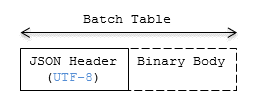
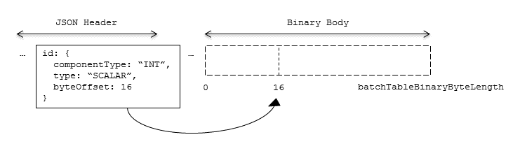

# Batch Table

## Contents

* [Overview](#overview)
* [Layout](#layout)
   * [Padding](#padding)
   * [JSON header](#json-header)
   * [Binary body](#binary-body)
* [Extensions](#extensions)
* [Implementation example](#implementation-example)
* [Property reference](#property-reference)

## Overview

A _Batch Table_ is a component of a tile's binary body and contains per-feature application-specific properties in a tile. These properties are queried at runtime for declarative styling and any application-specific use cases such as populating a UI or issuing a REST API request.  Some example Batch Table properties are building heights, geographic coordinates, and database primary keys.

A Batch Table is used by the following tile formats:
* [Batched 3D Model](../Batched3DModel/README.md) (b3dm)
* [Instanced 3D Model](../Instanced3DModel/README.md) (i3dm)
* [Point Cloud](../PointCloud/README.md) (pnts)

## Layout

A Batch Table is composed of two parts: a JSON header and an optional binary body in little endian. The JSON describes the properties, whose values either can be defined directly in the JSON as an array, or can refer to sections in the binary body.  It is more efficient to store long numeric arrays in the binary body. The following figure shows the Batch Table layout:



When a tile format includes a Batch Table, the Batch Table immediately follows the tile's Feature Table.
The header will also contain `batchTableJSONByteLength` and `batchTableBinaryByteLength` `uint32` fields, which can be used to extract each respective part of the Batch Table.

### Padding

The JSON header must end on an 8-byte boundary within the containing tile binary. The JSON header must be padded with trailing Space characters (`0x20`) to satisfy this requirement.

The binary body must start and end on an 8-byte boundary within the containing tile binary. The binary body must be padded with additional bytes, of any value, to satisfy this requirement.

Binary properties must start at a byte offset that is a multiple of the size in bytes of the property's `componentType`. For example, a property with the component type `FLOAT` has 4 bytes per element, and therefore must start at an offset that is a multiple of `4`. Preceding binary properties must be padded with additional bytes, of any value, to satisfy this requirement.

### JSON header

Batch Table values can be represented in the JSON header in two different ways:

1. An array of values, e.g., `"name" : ['name1', 'name2', 'name3']` or `"height" : [10.0, 20.0, 15.0]`.
    * Array elements can be any valid JSON data type, including objects and arrays.  Elements may be `null`.
    * The length of each array is equal to `batchLength`, which is specified in each tile format.  This is the number of features in the tile.  For example, `batchLength` may be the number of models in a b3dm tile, the number of instances in a i3dm tile, or the number of points (or number of objects) in a pnts tile.
2. A reference to data in the binary body, denoted by an object with `byteOffset`, `componentType`, and `type` properties,  e.g., `"height" : { "byteOffset" : 24, "componentType" : "FLOAT", "type" : "SCALAR"}`.
    * `byteOffset` specifies a zero-based offset relative to the start of the binary body. The value of `byteOffset` must be a multiple of the size in bytes of the property's `componentType`, e.g., a property with the component type `FLOAT` must have a `byteOffset` value that is a multiple of `4`.
    * `componentType` is the datatype of components in the attribute. Allowed values are `"BYTE"`, `"UNSIGNED_BYTE"`, `"SHORT"`, `"UNSIGNED_SHORT"`, `"INT"`, `"UNSIGNED_INT"`, `"FLOAT"`, and `"DOUBLE"`.
    * `type` specifies if the property is a scalar or vector. Allowed values are `"SCALAR"`, `"VEC2"`, `"VEC3"`, and `"VEC4"`.

The Batch Table JSON is a `UTF-8` string containing JSON.

> **Implementation Note:** In JavaScript, the Batch Table JSON can be extracted from an `ArrayBuffer` using the `TextDecoder` JavaScript API and transformed to a JavaScript object with `JSON.parse`.

A `batchId` is used to access elements in each array and extract the corresponding properties. For example, the following Batch Table has properties for a batch of two features:
```json
{
    "id" : ["unique id", "another unique id"],
    "displayName" : ["Building name", "Another building name"],
    "yearBuilt" : [1999, 2015],
    "address" : [{"street" : "Main Street", "houseNumber" : "1"}, {"street" : "Main Street", "houseNumber" : "2"}]
}
```

The properties for the feature with `batchId = 0` are
```javascript
id[0] = 'unique id';
displayName[0] = 'Building name';
yearBuilt[0] = 1999;
address[0] = {street : 'Main Street', houseNumber : '1'};
```

The properties for `batchId = 1` are
```javascript
id[1] = 'another unique id';
displayName[1] = 'Another building name';
yearBuilt[1] = 2015;
address[1] = {street : 'Main Street', houseNumber : '2'};
```
See [Property reference](#property-reference) for the full JSON header schema reference. The full JSON schema can be found in [batchTable.schema.json](../../schema/batchTable.schema.json).

### Binary body

When the JSON header includes a reference to the binary section, the provided `byteOffset` is used to index into the data, as shown in the following figure:



Values can be retrieved using the number of features, `batchLength`; the desired batch id, `batchId`; and the `componentType` and `type` defined in the JSON header.

The following tables can be used to compute the byte size of a property.

| `componentType` | Size in bytes |
| --- | --- |
| `"BYTE"` | 1 |
| `"UNSIGNED_BYTE"` | 1 |
| `"SHORT"` | 2 |
| `"UNSIGNED_SHORT"` | 2 |
| `"INT"` | 4 |
| `"UNSIGNED_INT"` | 4 |
| `"FLOAT"` | 4 |
| `"DOUBLE"` | 8 |

| `type` | Number of components |
| --- | --- |
| `"SCALAR"` | 1 |
| `"VEC2"` | 2 |
| `"VEC3"` | 3 |
| `"VEC4"` | 4 |

## Extensions

The following extensions can be applied to a Batch Table.

* [3DTILES_batch_table_hierarchy](../../../extensions/3DTILES_batch_table_hierarchy/)

## Implementation example

_This section is non-normative_

The following examples access the `"height"` and `"geographic"` values respectively given the following Batch Table JSON with `batchLength` of 10:

```json
{
    "height" : {
        "byteOffset" : 0,
        "componentType" : "FLOAT",
        "type" : "SCALAR"
    },
    "geographic" : {
        "byteOffset" : 40,
        "componentType" : "DOUBLE",
        "type" : "VEC3"
    }
}
```

To get the `"height"` values:

```javascript
var height = batchTableJSON.height;
var byteOffset = height.byteOffset;
var componentType = height.componentType;
var type = height.type;

var heightArrayByteLength = batchLength * sizeInBytes(componentType) * numberOfComponents(type); // 10 * 4 * 1
var heightArray = new Float32Array(batchTableBinary.buffer, byteOffset, heightArrayByteLength);
var heightOfFeature = heightArray[batchId];
```

To get the `"geographic"` values:

```javascript
var geographic = batchTableJSON.geographic;
var byteOffset = geographic.byteOffset;
var componentType = geographic.componentType;
var type = geographic.type;
var componentSizeInBytes = sizeInBytes(componentType)
var numberOfComponents = numberOfComponents(type);

var geographicArrayByteLength = batchLength * componentSizeInBytes * numberOfComponents // 10 * 8 * 3
var geographicArray = new Float64Array(batchTableBinary.buffer, byteOffset, geographicArrayByteLength);
var geographicOfFeature = positionArray.subarray(batchId * numberOfComponents, batchId * numberOfComponents + numberOfComponents); // Using subarray creates a view into the array, and not a new array.
```

Code for reading the Batch Table can be found in [`Cesium3DTileBatchTable.js`](https://github.com/CesiumGS/cesium/blob/master/Source/Scene/Cesium3DTileBatchTable.js) in the CesiumJS implementation of 3D Tiles.

## Property reference

* [`Batch Table`](#reference-batch-table)
* [`BinaryBodyReference`](#reference-binarybodyreference)
* [`Property`](#reference-property)


---------------------------------------
<a name="reference-batch-table"></a>
### Batch Table

A set of properties defining application-specific metadata for features in a tile.

**Properties**

|   |Type|Description|Required|
|---|----|-----------|--------|
|**extensions**|`object`|Dictionary object with extension-specific objects.|No|
|**extras**|`any`|Application-specific data.|No|

Additional properties are allowed.

* **Type of each property**: [`Property`](#reference-property)
#### BatchTable.extensions

Dictionary object with extension-specific objects.

* **Type**: `object`
* **Required**: No
* **Type of each property**: Extension

#### BatchTable.extras

Application-specific data.

* **Type**: `any`
* **Required**: No


---------------------------------------
<a name="reference-binarybodyreference"></a>
### BinaryBodyReference

An object defining the reference to a section of the binary body of the batch table where the property values are stored if not defined directly in the JSON.

**Properties**

|   |Type|Description|Required|
|---|----|-----------|--------|
|**byteOffset**|`number`|The offset into the buffer in bytes.| :white_check_mark: Yes|
|**componentType**|`string`|The datatype of components in the property.| :white_check_mark: Yes|
|**type**|`string`|Specifies if the property is a scalar or vector.| :white_check_mark: Yes|

Additional properties are allowed.

#### BinaryBodyReference.byteOffset :white_check_mark:

The offset into the buffer in bytes.

* **Type**: `number`
* **Required**: Yes
* **Minimum**: ` >= 0`

#### BinaryBodyReference.componentType :white_check_mark:

The datatype of components in the property.

* **Type**: `string`
* **Required**: Yes
* **Allowed values**:
   * `"BYTE"`
   * `"UNSIGNED_BYTE"`
   * `"SHORT"`
   * `"UNSIGNED_SHORT"`
   * `"INT"`
   * `"UNSIGNED_INT"`
   * `"FLOAT"`
   * `"DOUBLE"`

#### BinaryBodyReference.type :white_check_mark:

Specifies if the property is a scalar or vector.

* **Type**: `string`
* **Required**: Yes
* **Allowed values**:
   * `"SCALAR"`
   * `"VEC2"`
   * `"VEC3"`
   * `"VEC4"`


---------------------------------------
<a name="reference-property"></a>
### Property

A user-defined property which specifies per-feature application-specific metadata in a tile. Values either can be defined directly in the JSON as an array, or can refer to sections in the binary body with a [`BinaryBodyReference`](#reference-binarybodyreference) object.

* **JSON schema**: [`batchTable.schema.json`](../../schema/batchTable.schema.json)

