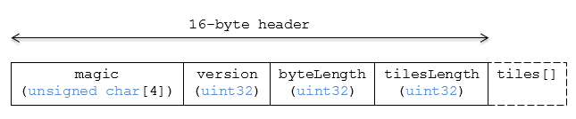

# Composite

## Contents

* [Overview](#overview)
* [Layout](#layout)
    * [Padding](#padding)
* [Header](#header)
* [Inner tiles](#inner-tiles)
* [File extension and MIME type](#file-extension-and-mime-type)
* [Implementation examples](#implementation-examples)

## Overview

The _Composite_ tile format enables concatenating tiles of different formats into one tile.

3D Tiles and the Composite tile allow flexibility for streaming heterogeneous datasets.  For example, buildings and trees could be stored either in two separate _Batched 3D Model_ and _Instanced 3D Model_ tiles or, using a _Composite_ tile, the tiles can be combined.

Supporting heterogeneous datasets with both inter-tile (separate tiles of different formats that are in the same tileset) and intra-tile (different tile formats that are in the same Composite tile) options allows conversion tools to make trade-offs between number of requests, optimal type-specific subdivision, and how visible/hidden layers are streamed.

A Composite tile is a binary blob in little endian.

## Layout

Composite layout (dashes indicate optional fields):

### Padding

A tile's `byteLength` must be aligned to an 8-byte boundary. All tiles contained in a composite tile must also be aligned to an 8-byte boundary.

## Header

The 16-byte header section contains the following fields:

|Field name|Data type|Description|
|----------|---------|-----------|
| `magic` | 4-byte ANSI string | `"cmpt"`.  This can be used to identify the content as a Composite tile. |
| `version` | `uint32` | The version of the Composite format. It is currently `1`. |
| `byteLength` | `uint32` | The length of the entire Composite tile, including this header and each inner tile, in bytes. |
| `tilesLength` | `uint32` | The number of tiles in the Composite. |

## Inner tiles

Inner tile fields are stored tightly packed immediately following the header section. The following information describes general characteristics of all tile formats that a Composite tile reader might exploit to find the boundaries of the inner tiles:

* Each tile starts with a 4-byte ANSI string, `magic`, that can be used to determine the tile format for further parsing.  See [tile format specifications](../../README.md#tile-format-specifications) for a list of possible formats.  Composite tiles can contain Composite tiles.
* Each tile's header contains a `uint32` `byteLength`, which defines the length of the inner tile, including its header, in bytes.  This can be used to traverse the inner tiles.
* For any tile format's version 1, the first 12 bytes of all tiles is the following fields:

|Field name|Data type|Description|
|----------|---------|-----------|
| `magic` | 4-byte ANSI string | Indicates the tile format |
| `version` | `uint32` | `1` |
| `byteLength` | `uint32` | Length, in bytes, of the entire tile. |

Refer to the spec for each tile format for more details.

## File extension and MIME type

Composite tiles use the `.cmpt` extension and `application/octet-stream` MIME type.

An explicit file extension is optional. Valid implementations may ignore it and identify a content's format by the `magic` field in its header.

## Implementation examples

_This section is non-normative_

* [Python `packcmpt` tool in gltf2glb toolset](https://github.com/Geopipe/gltf2glb) contains code for combining one or more _Batched 3D Model_ or _Instanced 3D Model_ tiles into a single Composite tile file.
* Code for reading the header can be found in
[`Composite3DTileContent.js`](https://github.com/CesiumGS/cesium/blob/main/Source/Scene/Composite3DTileContent.js)
in the CesiumJS implementation of 3D Tiles.
