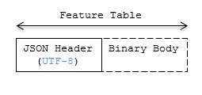

# Feature Table

## Contents

* [Overview](#overview)
* [Layout](#layout)
   * [Padding](#padding)
   * [JSON header](#json-header)
   * [Binary body](#binary-body)
* [Implementation example](#implementation-example)
* [Property reference](#property-reference)

## Overview

A _Feature Table_ is a component of a tile's binary body and describes position and appearance properties required to render each feature in a tile. The [Batch Table](../BatchTable/README.md), on the other hand, contains per-feature application-specific properties not necessarily used for rendering.

A Feature Table is used by tile formats like [Batched 3D Model](../Batched3DModel/README.md) (b3dm) where each model is a feature, and [Point Cloud](../PointCloud/README.md) (pnts) where each point is a feature.

Per-feature properties are defined using tile format-specific semantics defined in each tile format's specification.  For example, for _Instanced 3D Model_, `SCALE_NON_UNIFORM` defines the non-uniform scale applied to each 3D model instance.

## Layout

A Feature Table is composed of two parts: a JSON header and an optional binary body in little endian. The JSON property names are tile format-specific semantics, and their values can either be defined directly in the JSON, or refer to sections in the binary body.  It is more efficient to store long numeric arrays in the binary body. The following figure shows the Feature Table layout:



When a tile format includes a Feature Table, the Feature Table immediately follows the tile's header.  The header will also contain `featureTableJSONByteLength` and `featureTableBinaryByteLength` `uint32` fields, which can be used to extract each respective part of the Feature Table.

### Padding

The JSON header must end on an 8-byte boundary within the containing tile binary. The JSON header must be padded with trailing Space characters (`0x20`) to satisfy this requirement.

The binary body must start and end on an 8-byte boundary within the containing tile binary. The binary body must be padded with additional bytes, of any value, to satisfy this requirement.

Binary properties must start at a byte offset that is a multiple of the size in bytes of the property's implicit component type. For example, a property with the implicit component type `FLOAT` has 4 bytes per element, and therefore must start at an offset that is a multiple of `4`. Preceding binary properties must be padded with additional bytes, of any value, to satisfy this requirement.

### JSON header

Feature Table values can be represented in the JSON header in two different ways:

1. A single value or object, e.g., `"INSTANCES_LENGTH" : 4`.
   * This is used for global semantics like `"INSTANCES_LENGTH"`, which defines the number of model instances in an Instanced 3D Model tile.
2. A reference to data in the binary body, denoted by an object with a `byteOffset` property, e.g., `"SCALE" : { "byteOffset" : 24}`.
   * `byteOffset` specifies a zero-based offset relative to the start of the binary body. The value of `byteOffset` must be a multiple of the size in bytes of the property's implicit component type, e.g., the `"POSITION"` property has the component type `FLOAT` (4 bytes), so the value of `byteOffset` must be of a multiple of `4`.
   * The semantic defines the allowed data type, e.g., when `"POSITION"` in Instanced 3D Model refers to the binary body, the component type is `FLOAT` and the number of components is `3`.
   * Some semantics allow for overriding the implicit component type. These cases are specified in each tile format, e.g., `"BATCH_ID" : { "byteOffset" : 24, "componentType" : "UNSIGNED_BYTE"}`.
The only valid properties in the JSON header are the defined semantics by the tile format and optional `extras` and `extensions` properties.  Application-specific data should be stored in the Batch Table.

See [Property reference](#property-reference) for the full JSON header schema reference. The full JSON schema can be found in [featureTable.schema.json](../../schema/featureTable.schema.json).

### Binary body

When the JSON header includes a reference to the binary, the provided `byteOffset` is used to index into the data. The following figure shows indexing into the Feature Table binary body:


Values can be retrieved using the number of features, `featuresLength`; the desired feature id, `featureId`; and the data type (component type and number of components) for the feature semantic.

## Implementation example

_This section is non-normative_

The following example accesses the position property using the `POSITION` semantic, which has a `float32[3]` data type:

```javascript
var byteOffset = featureTableJSON.POSITION.byteOffset;

var positionArray = new Float32Array(featureTableBinary.buffer, byteOffset, featuresLength * 3); // There are three components for each POSITION feature.
var position = positionArray.subarray(featureId * 3, featureId * 3 + 3); // Using subarray creates a view into the array, and not a new array.
```

Code for reading the Feature Table can be found in [`Cesium3DTileFeatureTable.js`](https://github.com/CesiumGS/cesium/blob/main/Source/Scene/Cesium3DTileFeatureTable.js) in the CesiumJS implementation of 3D Tiles.


## Property reference

* [`Feature Table`](#reference-feature-table)
    * [`BinaryBodyReference`](#reference-binarybodyreference)
    * [`Property`](#reference-property)


---------------------------------------
<a name="reference-feature-table"></a>
### Feature Table

A set of semantics containing per-tile and per-feature values defining the position and appearance properties for features in a tile.

**Properties**

|   |Type|Description|Required|
|---|----|-----------|--------|
|**extensions**|`object`|Dictionary object with extension-specific objects.|No|
|**extras**|`any`|Application-specific data.|No|

Additional properties are allowed.

* **Type of each property**: [`Property`](#reference-property)
#### FeatureTable.extensions

Dictionary object with extension-specific objects.

* **Type**: `object`
* **Required**: No
* **Type of each property**: Extension

#### FeatureTable.extras

Application-specific data.

* **Type**: `any`
* **Required**: No


---------------------------------------
<a name="reference-binarybodyreference"></a>
### BinaryBodyReference

An object defining the reference to a section of the binary body of the features table where the property values are stored if not defined directly in the JSON.

**Properties**

|   |Type|Description|Required|
|---|----|-----------|--------|
|**byteOffset**|`number`|The offset into the buffer in bytes.| :white_check_mark: Yes|
|**componentType**|`string`|The datatype of components in the property. Some tile formats specify semantics where the implicit component type can be overridden using this property.| No|

Additional properties are allowed.

#### BinaryBodyReference.byteOffset :white_check_mark:

The offset into the buffer in bytes.

* **Type**: `number`
* **Required**: Yes
* **Minimum**: ` >= 0`

#### BinaryBodyReference.componentType

The datatype of components in the property.

* **Type**: `string`
* **Required**: No
* **Allowed values**:
   * `"BYTE"`
   * `"UNSIGNED_BYTE"`
   * `"SHORT"`
   * `"UNSIGNED_SHORT"`
   * `"INT"`
   * `"UNSIGNED_INT"`
   * `"FLOAT"`
   * `"DOUBLE"`


---------------------------------------
<a name="reference-property"></a>
### Property

A user-defined property which specifies per-feature application-specific metadata in a tile. Values either can be defined directly in the JSON as an array, or can refer to sections in the binary body with a [`BinaryBodyReference`](#reference-binarybodyreference) object.

* **JSON schema**: [`featureTable.schema.json`](../../schema/featureTable.schema.json)
