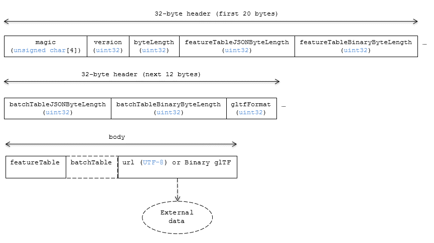
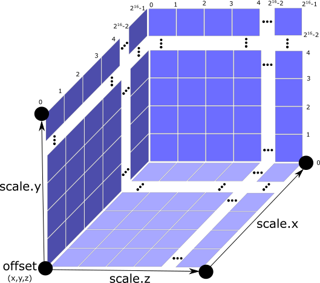

[#tileformats-instanced3dmodel-instanced-3d-model]
= Instanced 3D Model

// Definitions of the directory structure to ensure that relative
// links between ADOC files in sibling directories can be resolved.
ifdef::env-github[]
:url-specification: ../../
:url-specification-tileformats: {url-specification}TileFormats/
:url-specification-tileformats-batchtable: {url-specification-tileformats}BatchTable/
:url-specification-tileformats-composite: {url-specification-tileformats}Composite/
:url-specification-tileformats-featuretable: {url-specification-tileformats}FeatureTable/
:url-specification-tileformats-gltf: {url-specification-tileformats}glTF/
:url-specification-tileformats-gltf-migration: {url-specification-tileformats-gltf}MIGRATION.adoc
endif::[]
ifndef::env-github[]
:url-specification:
:url-specification-tileformats:
:url-specification-tileformats-batchtable:
:url-specification-tileformats-composite:
:url-specification-tileformats-featuretable:
:url-specification-tileformats-gltf:
:url-specification-tileformats-gltf-migration:
endif::[]

WARNING: Instanced 3D Model was deprecated in 3D Tiles 1.1. See xref:{url-specification-tileformats-gltf-migration}#tileformats-gltf-instanced-3d-model-i3dm[`i3dm` migration guide].

[#tileformats-instanced3dmodel-overview]
== Overview

_Instanced 3D Model_ is a tile format for efficient streaming and rendering of a large number of models, called _instances_, with slight variations.  In the simplest case, the same tree model, for example, may be located--or _instanced_--in several places.  Each instance references the same model and has per-instance properties, such as position.  Using the core 3D Tiles spec language, each instance is a _feature_.

In addition to trees, Instanced 3D Model is useful for exterior features such as fire hydrants, sewer caps, lamps, and traffic lights, and for interior CAD features such as bolts, valves, and electrical outlets.

An Instanced 3D Model tile is a binary blob in little endian.

[NOTE]
.Informative
====
A xref:{url-specification-tileformats-composite}README.adoc#tileformats-composite-composite[Composite] tile can be used to create tiles with different types of instanced models, e.g., trees and traffic lights by combing two Instanced 3D Model tiles.
====

[NOTE]
.Informative
====
Instanced 3D Model maps well to the link:https://www.khronos.org/registry/webgl/extensions/ANGLE_instanced_arrays/[`ANGLE_instanced_arrays`] extension for efficient rendering with WebGL.
====

[#tileformats-instanced3dmodel-layout]
== Layout

A tile is composed of a header section immediately followed by a binary body. The following figure shows the Instanced 3D Model layout (dashes indicate optional fields):

.Data layout for Instanced 3D Models

[#tileformats-instanced3dmodel-padding]
=== Padding

A tile's `byteLength` shall be aligned to an 8-byte boundary. The contained xref:{url-specification-tileformats-featuretable}README.adoc#tileformats-featuretable-padding[Feature Table] and xref:{url-specification-tileformats-batchtable}README.adoc#tileformats-batchtable-padding[Batch Table] shall conform to their respective padding requirement.

The <<tileformats-instanced3dmodel-gltf,binary glTF>> (if present) shall start and end on an 8-byte boundary so that glTF's byte-alignment guarantees are met. The proper alignment for the start of the binary glTF data can be achieved by padding the Feature Table, or by padding the Batch Table if it is present. The alignment for the end of the binary glTF data can be achieved by padding the tile data with 0-bytes. The actual binary glTF data does _not_ include possible trailing padding bytes. Clients must take into account the `length` from the https://registry.khronos.org/glTF/specs/2.0/glTF-2.0.html#binary-gltf-layout[binary glTF header], and use this length to determine the part of the tile data that actually represents the binary glTF. 

Otherwise, if the glTF field is a UTF-8 string, it shall be padded with trailing Space characters (`0x20`) to satisfy alignment requirements of the tile, which shall be removed at runtime before requesting the glTF asset.

[#tileformats-instanced3dmodel-header]
== Header

The 32-byte header contains the following fields:

.Header fields for Instanced 3D Models
[cols="2,1,3"]
|===
| Field name | Data type | Description

| `magic`
| 4-byte ANSI string
| `"i3dm"`.  This can be used to identify the content as an Instanced 3D Model tile.

| `version`
| `uint32`
| The version of the Instanced 3D Model format. It is currently `1`.

| `byteLength`
| `uint32`
| The length of the entire tile, including the header, in bytes.

| `featureTableJSONByteLength`
| `uint32`
| The length of the Feature Table JSON section in bytes.

| `featureTableBinaryByteLength`
| `uint32`
| The length of the Feature Table binary section in bytes.

| `batchTableJSONByteLength`
| `uint32`
| The length of the Batch Table JSON section in bytes. Zero indicates that there is no Batch Table.

| `batchTableBinaryByteLength`
| `uint32`
| The length of the Batch Table binary section in bytes. If `batchTableJSONByteLength` is zero, this will also be zero.

| `gltfFormat`
| `uint32`
| Indicates the format of the glTF field of the body.  `0` indicates it is a URI, `1` indicates it is embedded binary glTF.  See the <<tileformats-instanced3dmodel-gltf,glTF>> section below.
|===

The body section immediately follows the header section and is composed of three fields: `Feature Table`, `Batch Table`, and `glTF`.

[#tileformats-instanced3dmodel-feature-table]
== Feature Table

The Feature Table contains values for `i3dm` semantics used to create instanced models.
More information is available in the xref:{url-specification-tileformats-featuretable}README.adoc#tileformats-featuretable-feature-table[Feature Table specification].

The full JSON schema can be found in 
ifdef::env-github[]
link:https://github.com/CesiumGS/3d-tiles/tree/draft-1.1/specification/schema/TileFormats/i3dm.featureTable.schema.json[`i3dm.featureTable.schema.json`].
endif::[]
ifndef::env-github[]
<<reference-schema-i3dm-featuretable,`i3dm.featureTable.schema.json`>>.
endif::[]

[#tileformats-instanced3dmodel-semantics]
=== Semantics

[#tileformats-instanced3dmodel-instance-semantics]
==== Instance semantics

These semantics map to an array of feature values that are used to create instances. The length of these arrays shall be the same for all semantics and is equal to the number of instances.
The value for each instance semantic shall be a reference to the Feature Table binary body; they cannot be embedded in the Feature Table JSON header.

If a semantic has a dependency on another semantic, that semantic shall be defined.
If both `SCALE` and `SCALE_NON_UNIFORM` are defined for an instance, both scaling operations will be applied.
If both `POSITION` and `POSITION_QUANTIZED` are defined for an instance, the higher precision `POSITION` will be used.
If `NORMAL_UP`, `NORMAL_RIGHT`, `NORMAL_UP_OCT32P`, and `NORMAL_RIGHT_OCT32P` are defined for an instance, the higher precision `NORMAL_UP` and `NORMAL_RIGHT` will be used.

.Semantics for instances of an Instanced 3D Model
[cols="2,2,3,1"]
|===
| Semantic | Data Type | Description | Required

| `POSITION`
| `float32[3]`
| A 3-component array of numbers containing `x`, `y`, and `z` Cartesian coordinates for the position of the instance.
| Yes, unless `POSITION_QUANTIZED` is defined.

| `POSITION_QUANTIZED`
| `uint16[3]`
| A 3-component array of numbers containing `x`, `y`, and `z` in quantized Cartesian coordinates for the position of the instance.
| Yes, unless `POSITION` is defined.

| `NORMAL_UP`
| `float32[3]`
| A unit vector defining the `up` direction for the orientation of the instance.
| No, unless `NORMAL_RIGHT` is defined.

| `NORMAL_RIGHT`
| `float32[3]`
| A unit vector defining the `right` direction for the orientation of the instance. Shall be orthogonal to `up`.
| No, unless `NORMAL_UP` is defined.

| `NORMAL_UP_OCT32P`
| `uint16[2]`
| An oct-encoded unit vector with 32-bits of precision defining the `up` direction for the orientation of the instance.
| No, unless `NORMAL_RIGHT_OCT32P` is defined.

| `NORMAL_RIGHT_OCT32P`
| `uint16[2]`
| An oct-encoded unit vector with 32-bits of precision defining the `right` direction for the orientation of the instance. Shall be orthogonal to `up`.
| No, unless `NORMAL_UP_OCT32P` is defined.

| `SCALE`
| `float32`
| A number defining a scale to apply to all axes of the instance.
| No.

| `SCALE_NON_UNIFORM`
| `float32[3]`
| A 3-component array of numbers defining the scale to apply to the `x`, `y`, and `z` axes of the instance.
| No.

| `BATCH_ID`
| `uint8`, `uint16` (default), or `uint32`
| The `batchId` of the instance that can be used to retrieve metadata from the `Batch Table`.
| No.
|===

[#tileformats-instanced3dmodel-global-semantics]
==== Global semantics

These semantics define global properties for all instances.

.Global semantics for Instanced 3D Models
[cols="2,2,3,1"]
|===
| Semantic | Data Type | Description | Required

| `INSTANCES_LENGTH`
| `uint32`
| The number of instances to generate. The length of each array value for an instance semantic should be equal to this.
| Yes.

| `RTC_CENTER`
| `float32[3]`
| A 3-component array of numbers defining the center position when instance positions are defined relative-to-center.
| No.

| `QUANTIZED_VOLUME_OFFSET`
| `float32[3]`
| A 3-component array of numbers defining the offset for the quantized volume.
| No, unless `POSITION_QUANTIZED` is defined.

| `QUANTIZED_VOLUME_SCALE`
| `float32[3]`
| A 3-component array of numbers defining the scale for the quantized volume.
| No, unless `POSITION_QUANTIZED` is defined.

| `EAST_NORTH_UP`
| `boolean`
| When `true` and per-instance orientation is not defined, each instance will default to the `east/north/up` reference frame's orientation on the `WGS84` ellipsoid.
| No.
|===

Examples using these semantics can be found in the <<tileformats-instanced3dmodel-examples,examples section>>.

[#tileformats-instanced3dmodel-instance-orientation]
=== Instance orientation

An instance's orientation is defined by an orthonormal basis created by an `up` and `right` vector. The orientation will be transformed by the xref:{url-specification}README.adoc#core-tile-transforms[tile transform].

The `x` vector in the standard basis maps to the `right` vector in the transformed basis, and the `y` vector maps to the `up` vector.
The `z` vector would map to a `forward` vector, but it is omitted because it will always be the cross product of `right` and `up`.

.A box in the standard basis
image::figures/box-standard-basis.png[box standard basis]

.A box transformed into a rotated basis
image::figures/box-rotated-basis.png[box rotated basis]

[#tileformats-instanced3dmodel-oct-encoded-normal-vectors]
==== Oct-encoded normal vectors

If `NORMAL_UP` and `NORMAL_RIGHT` are not defined for an instance, its orientation may be stored as oct-encoded normals in `NORMAL_UP_OCT32P` and `NORMAL_RIGHT_OCT32P`.
These define `up` and `right` using the oct-encoding described in link:http://jcgt.org/published/0003/02/01/[_A Survey of Efficient Representations of Independent Unit Vectors_]. Oct-encoded values are stored in unsigned, unnormalized range (`[0, 65535]`) and then mapped to a signed normalized range (`[-1.0, 1.0]`) at runtime.

[NOTE]
.Informative
====
An implementation for encoding and decoding these unit vectors can be found in CesiumJS's link:https://github.com/CesiumGS/cesium/blob/main/packages/engine/Source/Core/AttributeCompression.js[AttributeCompression]
module.
====

[#tileformats-instanced3dmodel-default-orientation]
==== Default orientation

If `NORMAL_UP` and `NORMAL_RIGHT` or `NORMAL_UP_OCT32P` and `NORMAL_RIGHT_OCT32P` are not present, the instance will not have a custom orientation. If `EAST_NORTH_UP` is `true`, the instance is assumed to be on the `WGS84` ellipsoid and its orientation will default to the `east/north/up` reference frame at its cartographic position.
This is suitable for instanced models such as trees whose orientation is always facing up from their position on the ellipsoid's surface.

[#tileformats-instanced3dmodel-instance-position]
=== Instance position

`POSITION` defines the location for an instance before any tile transforms are applied.

[#tileformats-instanced3dmodel-rtc_center]
==== RTC_CENTER

Positions may be defined relative-to-center for high-precision rendering, see link:http://help.agi.com/AGIComponents/html/BlogPrecisionsPrecisions.htm[Precisions, Precisions]. If defined, `RTC_CENTER` specifies the center position and all instance positions are treated as relative to this value. See <<tileformats-instanced3dmodel-coordinate-system,Coordinate System>> for the effect that this property has on the transform.

[#tileformats-instanced3dmodel-quantized-positions]
==== Quantized positions

If `POSITION` is not defined for an instance, its position may be stored in `POSITION_QUANTIZED`, which defines the instance position relative to the quantized volume.
If neither `POSITION` or `POSITION_QUANTIZED` are defined, the instance will not be created.

A quantized volume is defined by `offset` and `scale` to map quantized positions into local space, as shown in the following figure:

.Illustration of the quantization that is used for the `POSITION_QUANTIZED` semantic

`offset` is stored in the global semantic `QUANTIZED_VOLUME_OFFSET`, and `scale` is stored in the global semantic `QUANTIZED_VOLUME_SCALE`.
If those global semantics are not defined, `POSITION_QUANTIZED` cannot be used.

Quantized positions can be mapped to local space using the following formula:

`POSITION = POSITION_QUANTIZED * QUANTIZED_VOLUME_SCALE / 65535.0 + QUANTIZED_VOLUME_OFFSET`

Compressed attributes should be decompressed before any other transforms are applied.

[#tileformats-instanced3dmodel-instance-scaling]
=== Instance scaling

Scaling can be applied to instances using the `SCALE` and `SCALE_NON_UNIFORM` semantics.
`SCALE` applies a uniform scale along all axes, and `SCALE_NON_UNIFORM` applies scaling to the `x`, `y`, and `z` axes independently.

[#tileformats-instanced3dmodel-examples]
=== Examples

These examples show how to generate JSON and binary buffers for the Feature Table.

[#tileformats-instanced3dmodel-positions-only]
==== Positions only

In this minimal example, we place four instances on the corners of a unit length square with the default orientation:

[%unnumbered]
[source,javascript]
----
var featureTableJSON = {
    INSTANCES_LENGTH : 4,
    POSITION : {
        byteOffset : 0
    }
};

var featureTableBinary = new Buffer(new Float32Array([
    0.0, 0.0, 0.0,
    1.0, 0.0, 0.0,
    0.0, 0.0, 1.0,
    1.0, 0.0, 1.0
]).buffer);
----

[#tileformats-instanced3dmodel-quantized-positions-and-oct-encoded-normals]
==== Quantized positions and oct-encoded normals

In this example, the four instances will be placed with an orientation `up` of `[0.0, 1.0, 0.0]` and `right` of `[1.0, 0.0, 0.0]` in oct-encoded format
and they will be placed on the corners of a quantized volume that spans from `-250.0` to `250.0` units in the `x` and `z` directions:

[%unnumbered]
[source,javascript]
----
var featureTableJSON = {
    INSTANCES_LENGTH : 4,
    QUANTIZED_VOLUME_OFFSET : [-250.0, 0.0, -250.0],
    QUANTIZED_VOLUME_SCALE : [500.0, 0.0, 500.0],
    POSITION_QUANTIZED : {
        byteOffset : 0
    },
    NORMAL_UP_OCT32P : {
        byteOffset : 24
    },
    NORMAL_RIGHT_OCT32P : {
        byteOffset : 40
    }
};

var positionQuantizedBinary = new Buffer(new Uint16Array([
    0, 0, 0,
    65535, 0, 0,
    0, 0, 65535,
    65535, 0, 65535
]).buffer);

var normalUpOct32PBinary = new Buffer(new Uint16Array([
    32768, 65535,
    32768, 65535,
    32768, 65535,
    32768, 65535
]).buffer);

var normalRightOct32PBinary = new Buffer(new Uint16Array([
    65535, 32768,
    65535, 32768,
    65535, 32768,
    65535, 32768
]).buffer);

var featureTableBinary = Buffer.concat([positionQuantizedBinary, normalUpOct32PBinary, normalRightOct32PBinary]);
----

[#tileformats-instanced3dmodel-batch-table]
== Batch Table

Contains metadata organized by `batchId` that can be used for declarative styling. See the xref:{url-specification-tileformats-batchtable}README.adoc#tileformats-batchtable-batch-table[Batch Table] reference for more information.

[#tileformats-instanced3dmodel-gltf]
== glTF

Instanced 3D Model embeds link:https://github.com/KhronosGroup/glTF/tree/main/specification/2.0[glTF 2.0] containing model geometry and texture information.

The glTF asset to be instanced is stored after the Feature Table and Batch Table. It may embed all of its geometry, texture, and animations, or it may refer to external sources for some or all of these data.

`header.gltfFormat` determines the format of the glTF field

* When the value of `header.gltfFormat` is `0`, the glTF field is a UTF-8 string, which contains a URI of the glTF or binary glTF model content.
* When the value of `header.gltfFormat` is `1`, the glTF field is a binary blob containing link:https://www.khronos.org/registry/glTF/specs/2.0/glTF-2.0.html#binary-gltf-layout[binary glTF].

When the glTF field contains a URI, then this URI may point to a link:https://tools.ietf.org/html/rfc3986#section-4.2[relative external reference (RFC3986)]. When the URI is relative, its base is always relative to the referring `.i3dm` file. Client implementations are required to support relative external references. Optionally, client implementations may support other schemes (such as `http://`). All URIs shall be valid and resolvable.

[#tileformats-instanced3dmodel-coordinate-system]
=== Coordinate system

By default glTFs use a right handed coordinate system where the _y_-axis is up. For consistency with the _z_-up coordinate system of 3D Tiles, glTFs shall be transformed at runtime. See xref:{url-specification}README.adoc#core-gltf-transforms[glTF transforms] for more details.

When the <<tileformats-instanced3dmodel-rtc_center,`RTC_CENTER`>> is defined in the feature table of an Instanced 3D Model, the computation of the xref:{url-specification}README.adoc#core-tile-transforms[tile transform] is done as follows:

. xref:{url-specification}README.adoc#core-gltf-node-hierarchy[glTF node hierarchy transformations]
. xref:{url-specification}README.adoc#core-y-up-to-z-up[glTF _y_-up to _z_-up transform]
. The per-instance positions and scales, as defined in the feature table of the Instanced 3D Model.
. The transform for the `RTC_CENTER`, which is used to translate model vertices
. xref:{url-specification}README.adoc#core-tile-transforms[Tile transform]

[#tileformats-instanced3dmodel-file-extension-and-media-type]
== File extension and media type

Instanced 3D models tiles use the `.i3dm` extension and `application/octet-stream` media type.

An explicit file extension is optional. Valid implementations may ignore it and identify a content's format by the `magic` field in its header.
