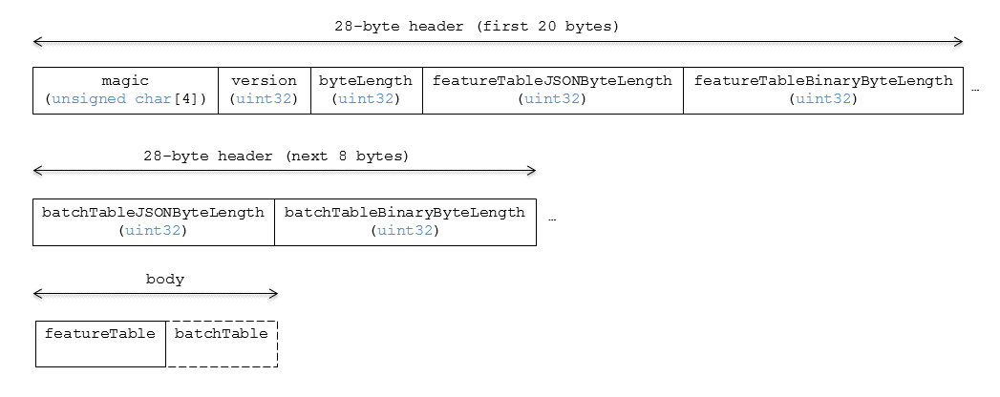

[#tileformats-pointcloud-point-cloud]
= Point Cloud

// Definitions of the directory structure to ensure that relative
// links between ADOC files in sibling directories can be resolved.
ifdef::env-github[]
:url-specification: ../../
:url-specification-tileformats: {url-specification}TileFormats/
:url-specification-tileformats-batched3dmodel: {url-specification-tileformats}Batched3DModel/
:url-specification-tileformats-batchtable: {url-specification-tileformats}BatchTable/
:url-specification-tileformats-featuretable: {url-specification-tileformats}FeatureTable/
:url-specification-tileformats-gltf: {url-specification-tileformats}glTF/
:url-specification-tileformats-gltf-migration: {url-specification-tileformats-gltf}MIGRATION.adoc
:url-specification-styling: {url-specification}Styling/
endif::[]
ifndef::env-github[]
:url-specification:
:url-specification-tileformats:
:url-specification-tileformats-batched3dmodel:
:url-specification-tileformats-batchtable:
:url-specification-tileformats-featuretable:
:url-specification-tileformats-gltf:
:url-specification-tileformats-gltf-migration:
:url-specification-styling:
endif::[]

WARNING: Point Cloud was deprecated in 3D Tiles 1.1. See See xref:{url-specification-tileformats-gltf-migration}#tileformats-gltf-point-cloud-pnts[`pnts` migration guide].

[#tileformats-pointcloud-overview]
== Overview

The _Point Cloud_ tile format enables efficient streaming of massive point clouds for 3D visualization. Each point is defined by a position and by optional properties used to define its appearance, such as color and normal, as well as optional properties that define application-specific metadata.

Using 3D Tiles terminology, each point is a _feature_.

A Point Cloud tile is a binary blob in little endian.

[#tileformats-pointcloud-layout]
== Layout

A tile is composed of a header section immediately followed by a body section. The following figure shows the Point Cloud layout (dashes indicate optional fields):

.Data layout for a Point Cloud

[#tileformats-pointcloud-padding]
=== Padding

A tile's `byteLength` must be aligned to an 8-byte boundary. The contained xref:{url-specification-tileformats-featuretable}README.adoc#tileformats-featuretable-padding[Feature Table] and xref:{url-specification-tileformats-batchtable}README.adoc#tileformats-batchtable-padding[Batch Table] must conform to their respective padding requirement.

[#tileformats-pointcloud-header]
== Header

The 28-byte header contains the following fields:

[cols="2,1,3"]
|===
| Field name | Data type | Description

| `magic`
| 4-byte ANSI string
| `"pnts"`.  This can be used to identify the content as a Point Cloud tile.

| `version`
| `uint32`
| The version of the Point Cloud format. It is currently `1`.

| `byteLength`
| `uint32`
| The length of the entire tile, including the header, in bytes.

| `featureTableJSONByteLength`
| `uint32`
| The length of the Feature Table JSON section in bytes.

| `featureTableBinaryByteLength`
| `uint32`
| The length of the Feature Table binary section in bytes.

| `batchTableJSONByteLength`
| `uint32`
| The length of the Batch Table JSON section in bytes. Zero indicates that there is no Batch Table.

| `batchTableBinaryByteLength`
| `uint32`
| The length of the Batch Table binary section in bytes. If `batchTableJSONByteLength` is zero, this will also be zero.
|===

The body section immediately follows the header section, and is composed of a `Feature Table` and `Batch Table`.

[#tileformats-pointcloud-feature-table]
== Feature Table

Contains per-tile and per-point values that define where and how to render points.
More information is available in the xref:{url-specification-tileformats-featuretable}README.adoc#tileformats-featuretable-feature-table[Feature Table specification].

The full JSON schema can be found in link:https://github.com/CesiumGS/3d-tiles/tree/draft-1.1/specification/schema/TileFormats/pnts.featureTable.schema.json[pnts.featureTable.schema.json].

[#tileformats-pointcloud-semantics]
=== Semantics

[#tileformats-pointcloud-point-semantics]
==== Point semantics

These semantics map to an array of feature values that define each point. The length of these arrays must be the same for all semantics and is equal to the number of points.
The value for each point semantic must be a reference to the Feature Table binary body; they cannot be embedded in the Feature Table JSON header.

If a semantic has a dependency on another semantic, that semantic must be defined.
If both `POSITION` and `POSITION_QUANTIZED` are defined for a point, the higher precision `POSITION` will be used.
If both `NORMAL` and `NORMAL_OCT16P` are defined for a point, the higher precision `NORMAL` will be used.

[cols="2,2,3,1"]
|===
| Semantic | Data Type | Description | Required

| `POSITION`
| `float32[3]`
| A 3-component array of numbers containing `x`, `y`, and `z` Cartesian coordinates for the position of the point.
| Yes, unless `POSITION_QUANTIZED` is defined.

| `POSITION_QUANTIZED`
| `uint16[3]`
| A 3-component array of numbers containing `x`, `y`, and `z` in quantized Cartesian coordinates for the position of the point.
| Yes, unless `POSITION` is defined.

| `RGBA`
| `uint8[4]`
| A 4-component array of values containing the `RGBA` color of the point.
| No.

| `RGB`
| `uint8[3]`
| A 3-component array of values containing the `RGB` color of the point.
| No.

| `RGB565`
| `uint16`
| A lossy compressed color format that packs the `RGB` color into 16 bits, providing 5 bits for red, 6 bits for green, and 5 bits for blue.
| No.

| `NORMAL`
| `float32[3]`
| A unit vector defining the normal of the point.
| No.

| `NORMAL_OCT16P`
| `uint8[2]`
| An oct-encoded unit vector with 16 bits of precision defining the normal of the point.
| No.

| `BATCH_ID`
| `uint8`, `uint16` (default), or `uint32`
| The `batchId` of the point that can be used to retrieve metadata from the `Batch Table`.
| No.
|===

[#tileformats-pointcloud-global-semantics]
==== Global semantics

These semantics define global properties for all points.

[cols="2,2,3,1"]
|===
| Semantic | Data Type | Description | Required

| `POINTS_LENGTH`
| `uint32`
| The number of points to render. The length of each array value for a point semantic should be equal to this.
| Yes.

| `RTC_CENTER`
| `float32[3]`
| A 3-component array of numbers defining the center position when point positions are defined relative-to-center.
| No.

| `QUANTIZED_VOLUME_OFFSET`
| `float32[3]`
| A 3-component array of numbers defining the offset for the quantized volume.
| No, unless `POSITION_QUANTIZED` is defined.

| `QUANTIZED_VOLUME_SCALE`
| `float32[3]`
| A 3-component array of numbers defining the scale for the quantized volume.
| No, unless `POSITION_QUANTIZED` is defined.

| `CONSTANT_RGBA`
| `uint8[4]`
| A 4-component array of values defining a constant `RGBA` color for all points in the tile.
| No.

| `BATCH_LENGTH`
| `uint32`
| The number of unique `BATCH_ID` values.
| No, unless `BATCH_ID` is defined.
|===

Examples using these semantics can be found in the <<tileformats-pointcloud-examples,examples section>> below.

[#tileformats-pointcloud-point-positions]
=== Point positions

`POSITION` defines the position for a point before any tileset transforms are applied.

[#tileformats-pointcloud-coordinate-reference-system-crs]
==== Coordinate reference system (CRS)

3D Tiles local coordinate systems use a right-handed 3-axis (x, y, z) Cartesian coordinate system; that is, the cross product of _x_ and _y_ yields _z_. 3D Tiles defines the _z_ axis as up for local Cartesian coordinate systems (also see xref:{url-specification}README.adoc#core-coordinate-reference-system-crs[coordinate reference system]).

[#tileformats-pointcloud-rtc_center]
==== RTC_CENTER

Positions may be defined relative-to-center for high-precision rendering, see link:http://help.agi.com/AGIComponents/html/BlogPrecisionsPrecisions.htm[Precisions, Precisions]. If defined, `RTC_CENTER` specifies the center position and all point positions are treated as relative to this value.

[#tileformats-pointcloud-quantized-positions]
==== Quantized positions

If `POSITION` is not defined, positions may be stored in `POSITION_QUANTIZED`, which defines point positions relative to the quantized volume.
If neither `POSITION` nor `POSITION_QUANTIZED` is defined, the tile does not need to be rendered.

A quantized volume is defined by `offset` and `scale` to map quantized positions to a position in local space. The following figure shows a quantized volume based on `offset` and `scale`:

.Illustration of the quantization that is used for the `POSITION_QUANTIZED` semantic
image::figures/quantized-volume.png[quantized volume]

`offset` is stored in the global semantic `QUANTIZED_VOLUME_OFFSET`, and `scale` is stored in the global semantic `QUANTIZED_VOLUME_SCALE`.
If those global semantics are not defined, `POSITION_QUANTIZED` cannot be used.

Quantized positions can be mapped to local space using the following formula:

`POSITION = POSITION_QUANTIZED * QUANTIZED_VOLUME_SCALE / 65535.0 + QUANTIZED_VOLUME_OFFSET`

Compressed attributes should be decompressed before any other transforms are applied.

[#tileformats-pointcloud-point-colors]
=== Point colors

If more than one color semantic is defined, the precedence order is `RGBA`, `RGB`, `RGB565`, then `CONSTANT_RGBA`. For example, if a tile's Feature Table contains both `RGBA` and `CONSTANT_RGBA` properties, the runtime would render with per-point colors using `RGBA`.

If no color semantics are defined, the runtime is free to color points using an application-specific default color.

In any case, xref:{url-specification-styling}README.adoc#styling-styling[3D Tiles Styling] may be used to change the final rendered color and other visual properties at runtime.

[#tileformats-pointcloud-point-normals]
=== Point normals

Per-point normals are an optional property that can help improve the visual quality of points by enabling lighting, hidden surface removal, and other rendering techniques.
The normals will be transformed using the inverse transpose of the tileset transform.

[#tileformats-pointcloud-oct-encoded-normal-vectors]
==== Oct-encoded normal vectors

Oct-encoding is described in link:http://jcgt.org/published/0003/02/01/[_A Survey of Efficient Representations of Independent Unit Vectors_]. Oct-encoded values are stored in unsigned, unnormalized range (`[0, 255]`) and then mapped to a signed normalized range (`[-1.0, 1.0]`) at runtime.

[NOTE]
.Implementation Note
====
An implementation for encoding and decoding these unit vectors can be found in CesiumJS's link:https://github.com/CesiumGS/cesium/blob/main/Source/Core/AttributeCompression.js[AttributeCompression]
module.
====

Compressed attributes should be decompressed before any other transforms are applied.

[#tileformats-pointcloud-batched-points]
=== Batched points

Points that make up distinct features of the Point Cloud may be batched together using the `BATCH_ID` semantic. For example, the points that make up a door in a house would all be assigned the same `BATCH_ID`, whereas points that make up a window would be assigned a different `BATCH_ID`.
This is useful for per-object picking and storing application-specific metadata for declarative styling and application-specific use cases such as populating a UI or issuing a REST API request on a per-object instead of per-point basis.

The `BATCH_ID` semantic may have a `componentType` of `UNSIGNED_BYTE`, `UNSIGNED_SHORT`, or `UNSIGNED_INT`. When `componentType` is not present, `UNSIGNED_SHORT` is used.
The global semantic `BATCH_LENGTH` defines the number of unique `batchId` values, similar to the `batchLength` field in the xref:{url-specification-tileformats-batched3dmodel}README.adoc#tileformats-batched3dmodel-batched-3d-model[Batched 3D Model] header.

[#tileformats-pointcloud-examples]
=== Examples

_This section is non-normative_

These examples show how to generate JSON and binary buffers for the Feature Table.

[#tileformats-pointcloud-positions-only]
==== Positions only

This minimal example has four points on the corners of a unit length square:

[source,javascript]
----
var featureTableJSON = {
    POINTS_LENGTH : 4,
    POSITION : {
        byteOffset : 0
    }
};

var featureTableBinary = new Buffer(new Float32Array([
    0.0, 0.0, 0.0,
    1.0, 0.0, 0.0,
    0.0, 0.0, 1.0,
    1.0, 0.0, 1.0
]).buffer);
----

[#tileformats-pointcloud-positions-and-colors]
==== Positions and colors

The following example has four points (red, green, blue, and yellow) above the globe. Their positions are defined relative to center:

[source,javascript]
----
var featureTableJSON = {
    POINTS_LENGTH : 4,
    RTC_CENTER : [1215013.8, -4736316.7, 4081608.4],
    POSITION : {
        byteOffset : 0
    },
    RGB : {
        byteOffset : 48
    }
};

var positionBinary = new Buffer(new Float32Array([
    0.0, 0.0, 0.0,
    1.0, 0.0, 0.0,
    0.0, 0.0, 1.0,
    1.0, 0.0, 1.0
]).buffer);

var colorBinary = new Buffer(new Uint8Array([
    255, 0, 0,
    0, 255, 0,
    0, 0, 255,
    255, 255, 0,
]).buffer);

var featureTableBinary = Buffer.concat([positionBinary, colorBinary]);
----

[#tileformats-pointcloud-quantized-positions-and-oct-encoded-normals]
==== Quantized positions and oct-encoded normals

In this example, the four points will have normals pointing up `[0.0, 1.0, 0.0]` in oct-encoded format, and they will be placed on the corners of a quantized volume that spans from `-250.0` to `250.0` units in the `x` and `z` directions:

[source,javascript]
----
var featureTableJSON = {
    POINTS_LENGTH : 4,
    QUANTIZED_VOLUME_OFFSET : [-250.0, 0.0, -250.0],
    QUANTIZED_VOLUME_SCALE : [500.0, 0.0, 500.0],
    POSITION_QUANTIZED : {
        byteOffset : 0
    },
    NORMAL_OCT16P : {
        byteOffset : 24
    }
};

var positionQuantizedBinary = new Buffer(new Uint16Array([
    0, 0, 0,
    65535, 0, 0,
    0, 0, 65535,
    65535, 0, 65535
]).buffer);

var normalOct16PBinary = new Buffer(new Uint8Array([
    128, 255,
    128, 255,
    128, 255,
    128, 255
]).buffer);

var featureTableBinary = Buffer.concat([positionQuantizedBinary, normalOct16PBinary]);
----

[#tileformats-pointcloud-batched-points-1]
==== Batched points

In this example, the first two points have a `batchId` of 0, and the next two points have a `batchId` of 1. Note that the Batch Table only has two names:

[source,javascript]
----
var featureTableJSON = {
    POINTS_LENGTH : 4,
    BATCH_LENGTH : 2,
    POSITION : {
        byteOffset : 0
    },
    BATCH_ID : {
        byteOffset : 48,
        componentType : "UNSIGNED_BYTE"
    }
};

var positionBinary = new Buffer(new Float32Array([
    0.0, 0.0, 0.0,
    1.0, 0.0, 0.0,
    0.0, 0.0, 1.0,
    1.0, 0.0, 1.0
]).buffer);

var batchIdBinary = new Buffer(new Uint8Array([
    0,
    0,
    1,
    1
]).buffer);

var featureTableBinary = Buffer.concat([positionBinary, batchIdBinary]);

var batchTableJSON = {
    names : ['object1', 'object2']
};
----

[#tileformats-pointcloud-per-point-properties]
==== Per-point properties

In this example, each of the 4 points will have metadata stored in the Batch Table JSON and binary.

[source,javascript]
----
var featureTableJSON = {
    POINTS_LENGTH : 4,
    POSITION : {
        byteOffset : 0
    }
};

var featureTableBinary = new Buffer(new Float32Array([
    0.0, 0.0, 0.0,
    1.0, 0.0, 0.0,
    0.0, 0.0, 1.0,
    1.0, 0.0, 1.0
]).buffer);

var batchTableJSON = {
    names : ['point1', 'point2', 'point3', 'point4']
};
----

[#tileformats-pointcloud-batch-table]
== Batch Table

The _Batch Table_ contains application-specific metadata, indexable by `batchId`, that can be used for declarative styling and application-specific use cases such as populating a UI or issuing a REST API request.

* If the `BATCH_ID` semantic is defined, the Batch Table stores metadata for each `batchId`, and the length of the Batch Table arrays will equal `BATCH_LENGTH`.
* If the `BATCH_ID` semantic is not defined, then the Batch Table stores per-point metadata, and the length of the Batch Table arrays will equal `POINTS_LENGTH`.

See the xref:{url-specification-tileformats-batchtable}README.adoc#tileformats-batchtable-batch-table[Batch Table] reference for more information.

[#tileformats-pointcloud-extensions]
== Extensions

The following extensions can be applied to a Point Cloud tile.

* link:https://github.com/CesiumGS/3d-tiles/tree/main/extensions/3DTILES_draco_point_compression/README.md[`3DTILES_draco_point_compression`]

[#tileformats-pointcloud-file-extension-and-mime-type]
== File extension and MIME type

Point cloud tiles use the `.pnts` extension and `application/octet-stream` MIME type.

An explicit file extension is optional. Valid implementations may ignore it and identify a content's format by the `magic` field in its header.

[#tileformats-pointcloud-implementation-example]
== Implementation example

_This section is non-normative_

Code for reading the header can be found in link:https://github.com/CesiumGS/cesium/blob/main/Source/Scene/PointCloud3DTileContent.js[`PointCloud3DModelTileContent.js`] in the CesiumJS implementation of 3D Tiles.

