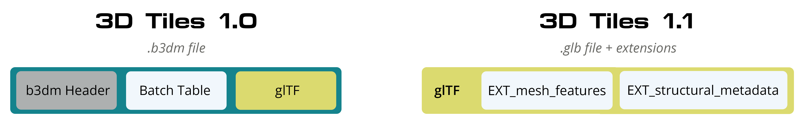
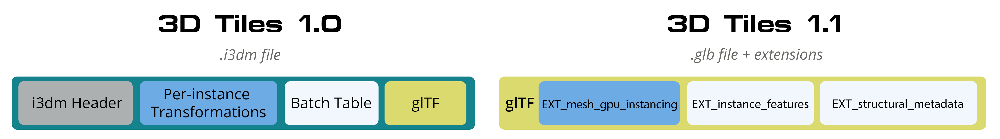
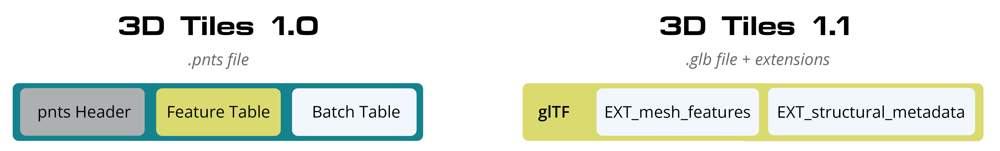

= glTF

== Overview

https://github.com/KhronosGroup/glTF[glTF 2.0] is the primary tile format for 3D Tiles. glTF is an open specification designed for the efficient transmission and loading of 3D content. A glTF asset includes geometry and texture information for a single tile, and may be extended to include metadata, model instancing, and compression. glTF may be used for a wide variety of 3D content including:

* Heterogeneous 3D models. E.g. textured terrain and surfaces, 3D building exteriors and interiors, massive models
* Massive point clouds
* 3D model instances. E.g. trees, windmills, bolts

== Use Cases

=== 3D Models

glTF provides flexibilty for a wide range of mesh and material configurations, and is well suited for photogrammetry as well as stylized 3D models.

[cols="^,^"]
|===
| Photogrammetry | 3D Buildings

| image:figures/glTF-photogrammetry.png[pdfwidth=40%]_San Francisco photogrammetry model from Aerometrex in O3DE_
| _3D buildings from swisstopo in CesiumJS_
|===

=== Point Clouds

glTF supports point clouds with the `0` (`POINTS`) primitive mode. Points can have positions, colors, normals, and custom attributes as specified in the `primitive.attributes` field.

image:figures/glTF-point-cloud.png[point-cloud]
_40 billion point cloud from the City of Montreal with ASPRS classification codes (https://donnees.montreal.ca/license-en[CC-BY 4.0])_

When using the https://github.com/CesiumGS/glTF/tree/3d-tiles-next/extensions/2.0/Vendor/EXT_mesh_features[`EXT_mesh_features`] extension points can be assigned feature IDs and these features can have associated metadata.

image:figures/point-cloud-layers.png[Point Cloud Features]
_A point cloud with two property tables, one storing metadata for groups of points and the other storing metadata for individual points_

=== Instancing

glTF can leverage GPU instancing with the https://github.com/KhronosGroup/glTF/blob/master/extensions/2.0/Vendor/EXT_mesh_gpu_instancing/README.md[`EXT_mesh_gpu_instancing`] extension. Instances can be given unique translations, rotations, scales, and other per-instance attributes.

_Instanced tree models in Philadelphia from OpenTreeMap_

When using the https://github.com/CesiumGS/glTF/tree/3d-tiles-next/extensions/2.0/Vendor/EXT_instance_features[`EXT_instance_features`] extension instances can be assigned feature IDs and these features can have associated metadata.

image:figures/multi-instance-metadata.png[Model Instance Features]
_Instanced tree models where trees are assigned to groups with a per-instance feature ID attribute. One feature table stores per-group metadata and the other stores per-tree metadata._

== Feature Identification

https://github.com/CesiumGS/glTF/tree/3d-tiles-next/extensions/2.0/Vendor/EXT_mesh_features[`EXT_mesh_features`] provides a means of assigning identifiers to geometry and subcomponents of geometry within a glTF 2.0 asset. Feature IDs can de assigned to vertices or texels. https://github.com/CesiumGS/glTF/tree/3d-tiles-next/extensions/2.0/Vendor/EXT_instance_features[`EXT_instance_features`] allows feature IDs to be assigned to individial instances.

image:figures/glTF-feature-identification.png[Per-texel features]
_Street level photogrammetry of San Francisco Ferry Building from Aerometrex. Left: per-texel colors showing the feature classification, e.g., roof, sky roof, windows, window frames, and AC units . Right: classification is used to determine rendering material properties, e.g., make the windows translucent._

== Metadata

https://github.com/CesiumGS/glTF/tree/3d-tiles-next/extensions/2.0/Vendor/EXT_structural_metadata[`EXT_structural_metadata`] stores metadata at per-vertex, per-texel, and per-feature granularity and uses the type system defined in the link:../../Metadata[3D Metadata Specification]. This metadata can be used for visualization and analysis.

== Compression

glTF has several extensions for geometry and texture compression. These extensions can help reduce file sizes and GPU memory usage.

=== Geometry Compression

* https://github.com/KhronosGroup/glTF/tree/master/extensions/2.0/Khronos/KHR_mesh_quantization[KHR_mesh_quantization]
* https://github.com/KhronosGroup/glTF/tree/master/extensions/2.0/Vendor/EXT_meshopt_compression[EXT_meshopt_compression]
* https://github.com/KhronosGroup/glTF/tree/master/extensions/2.0/Khronos/KHR_draco_mesh_compression[KHR_draco_mesh_compression]

=== Texture Compression

* https://github.com/KhronosGroup/glTF/tree/master/extensions/2.0/Khronos/KHR_texture_basisu[KHR_texture_basisu]

== File Extensions and Media Types

See https://www.khronos.org/registry/glTF/specs/2.0/glTF-2.0.html#file-extensions-and-media-types[glTF File Extensions and Media Types].

An explicit file extension is optional. Valid implementations may ignore it and identify a content's format through other means, such as the `magic` field in the binary glTF header or the presence of an `asset` field in JSON glTF.

== Appendix A: Migration From Legacy Tile Formats

This section describes how legacy tile formats can be converted into equivalent glTF content.

=== Batched 3D Model (b3dm)

link:../Batched3DModel[Batched 3D Model] is a wrapper around a binary glTF that includes additional information in its Feature Table and Batch Table. Batched 3D Model content can be converted into glTF content with the following changes:

* The https://github.com/CesiumGS/3d-tiles/tree/main/specification/TileFormats/Batched3DModel#coordinate-system[`RTC_CENTER`] can be added to the translation component of the root node of the glTF asset.
* Batch IDs and Batch Tables can be represented using https://github.com/CesiumGS/glTF/tree/3d-tiles-next/extensions/2.0/Vendor/EXT_mesh_features[`EXT_mesh_features`] and https://github.com/CesiumGS/glTF/tree/3d-tiles-next/extensions/2.0/Vendor/EXT_structural_metadata[`EXT_structural_metadata`].

=== Instanced 3D Model (i3dm)

link:../Instanced3DModel[Instanced 3D Model] instances a glTF asset (embedded or external) and provides per-instance transforms and batch IDs.

* The `RTC_CENTER` can be added to the translation component of the root node of the glTF asset.
* glTF can leverage GPU instancing with the https://github.com/KhronosGroup/glTF/blob/master/extensions/2.0/Vendor/EXT_mesh_gpu_instancing/README.md[EXT_mesh_gpu_instancing] extension.
* Batch IDs and Batch Tables can be represented using https://github.com/CesiumGS/glTF/tree/3d-tiles-next/extensions/2.0/Vendor/EXT_instance_features[`EXT_instance_features`] and https://github.com/CesiumGS/glTF/tree/3d-tiles-next/extensions/2.0/Vendor/EXT_structural_metadata[`EXT_structural_metadata`].
* `EAST_NORTH_UP` is not directly supported, but can be represented using per-instance rotations.

=== Point Cloud (pnts)

link:../PointCloud[Point Cloud] can be represented as a glTF using the primitive mode `0` (`POINTS`).

* The `RTC_CENTER` can be added to the translation component of the root node of the glTF asset.
* Feature table properties like `POSITION`, `COLOR`, and `NORMAL` may be stored as glTF attributes.
* https://github.com/KhronosGroup/glTF/tree/master/extensions/2.0/Vendor/EXT_meshopt_compression[`EXT_meshopt_compression`] and https://github.com/KhronosGroup/glTF/tree/master/extensions/2.0/Khronos/KHR_mesh_quantization[`KHR_mesh_quantization`] may be used for point cloud compression. link:../../../extensions/3DTILES_draco_point_compression/[`3DTILES_draco_point_compression`] is not directly supported in glTF because https://github.com/KhronosGroup/glTF/tree/master/extensions/2.0/Khronos/KHR_draco_mesh_compression[`KHR_draco_mesh_compression`] only supports triangle meshes.
* Batch IDs and Batch Tables can be represented using https://github.com/CesiumGS/glTF/tree/3d-tiles-next/extensions/2.0/Vendor/EXT_mesh_features[`EXT_mesh_features`] and https://github.com/CesiumGS/glTF/tree/3d-tiles-next/extensions/2.0/Vendor/EXT_structural_metadata[`EXT_structural_metadata`].
* `CONSTANT_RGBA` is not directly supported in glTF, but can be achieved with materials or per-point colors.

=== Composite (cmpt)

All inner contents of a link:../Composite[Composite] may be combined into the same glTF as separate nodes, meshes, or primitives, at the tileset author's discretion. Alternatively, a tile may have link:../../README.md#tile-content[multiple contents].
